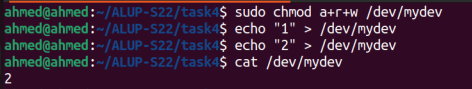
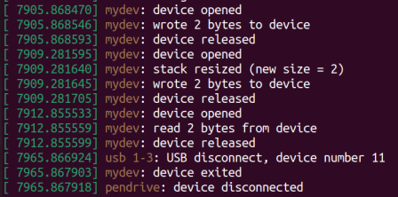
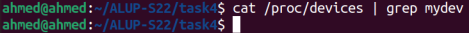
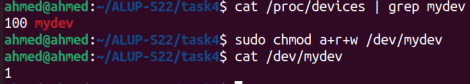

# Task 4 - USB driver

## Task

- Use a USB device (flash drive, mouse etc.) as an electronic key for the chardev from task3.
- The chardev should appear only when the USB device is inserted.
- Stack itself should not be destroyed when USB device is removed.


## Makefile
- To compile and load module: `sudo make`
- To unload module and clean working directory: `sudo make clean`


## Test

- Unload default USB drivers so that our module’s `probe` function will be called instead of the kernel’s.

  ```bash
  sudo rmmod uas usb_storage
  ```

- Compile and load module: `sudo make`

  

- Plug in USB and check kernel logs: `sudo dmesg -w`

  

- `mydev` is now available for usage.

  

- Unplug USB and check kernel logs.

  

- `mydev` is no longer available.

  

- Plug in USB again.

  

- `mydev` should now be available again with no loss of stack data.

  

- Unplug USB, unload module, clean working directory, and reload default  modules that we unloaded at the beginning.

  
