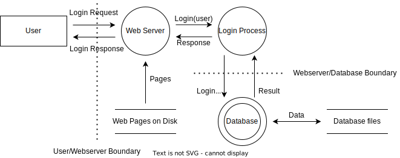
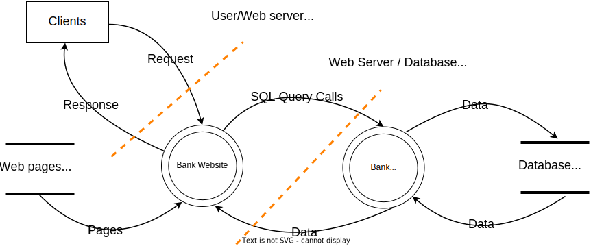

# Lab 2: Threat Modeling

## Task 1 - Architectural Diagram Summary

From the [architectural diagram](https://i.imgur.com/ad5nje0.png) we can see different system components interacting/communicating with each other through different protocols.

- The banking system has Android, iOS, and web applications that can be used by remote (untrusted) users to access different provided services including authentication and payment using HTTPS request to a Proxy server.
- Remote HTTPS requests are firewalled and can only access servers inside the DMZ through a load balancer (**HAProxy** is used).
- Servers inside the DMZ may communicate with internal networks (also firewalled) to:
  - Submit jobs to workers through a message queueing protocol (**RabbitMQ** is used)
  - Insert data into the database (**Redis** is used for personal data and **MSSQL** is used for financial data).
  - Perform transactions through the payment system.
  - Use an internal service (e.g., for transforming data into JSON format)
    - A separate internal cluster (firewalled) running **Microsoft BizTalk server** is used for providing such services.
- A separate (firewalled) payment cluster (**Way4**) with it's own (**Oracle**) database is used.
  - Communication with way4 happen only through an adaptor which can only be accessed by DMZ servers through a reverse proxy.
- Each cluster is isolated from others, firewalled, and may have its own logstash.
  - Logs are collected from different services and submitted to an internal cluster (**Amazon elasticsearch** is used) for centralized monitoring and analysis.

## Task 2 - Decomposing the Application

- Using OWASP threat modeling process, we analyze the application in terms of entry points, assets, trust levels, and data flows.
- The analysis is only based on the given architectural diagram; several assumptions were made as application details were not provided.

### 2.1. Trust Levels

| ID   | Name                                | Description                                                  |
| ---- | ----------------------------------- | ------------------------------------------------------------ |
| 1    | Anonymous web user                  | A user who has connected to the banking website but has not provided valid credentials. |
| 2    | User with valid login credentials   | A user who has connected to the banking website and has logged in using valid login credentials. |
| 3    | User with invalid login credentials | A user who has connected to the banking website and is attempting to log in using invalid login credentials. |
| 4    | Bank employee                       | The Bank employee can create users on the system and view their personal information. |
| 5    | Database server administrator       | The database server administrator has read and write access to the database that is used by the banking website. |
| 6    | Website administrator               | The Website administrator can configure the banking website. |
| 7    | Web server user process             | This is the process/user that the web server executes code as and authenticates itself against the database server as. |
| 8    | Database read user                  | The database user account used to access the database for read access. |
| 9    | Database read/write user            | The database user account used to access the database for read and write access. |

### 2.2 Entry Points

| ID    | Name           | Description                                                  | Trust Levels       |
| ----- | -------------- | :----------------------------------------------------------- | ------------------ |
| 1     | HTTPS Port     | The frontend web interface will be only be accessible via TLS. All pages within the application are layered on this entry point. | (1), (2), (3), (4) |
| 1.1   | Main page      | Website home page is the entry point for all users.          | (1), (2), (3), (4) |
| 1.2   | Login page     | Users need to log in before carrying out any usecase.        | (1), (2), (3), (4) |
| 1.2.1 | Login function | Accepts user credentials and validates them against the database | (2), (3), (4)      |

### 2.3 Assets

| ID    | Name                                                 | Description                                                  | Trust Level                 |
| ----- | ---------------------------------------------------- | ------------------------------------------------------------ | --------------------------- |
| **1** | **Clients and Employees**                            | **Assets relating to bank clients/users, and bank employees .** |                             |
| 1.1   | Clients Login Details                                | Information about clients credentials used to login to the mobile apps or bank website. | (2),(4),(5),(6),(7),(8),(9) |
| 1.2   | Clients personal data                                | Personal information may include many things such as names, DOB, payment information (e.g., MasterCard/VISA card number) and addresses. | (4),(5),(6),(7),(8),(9)     |
| 1.3   | Bank's Employee Login Details                        | Credentials that the employee will use to log in to the bank's system | (4),(5),(6),(7),(8),(9)     |
| **2** | **System**                                           | **Assets relating to the underlying system.**                |                             |
| 2.1   | Availability of Bank website                         | The bank website should be available 24/7 and can be accessed by any of the clients or any person on the internet. | (5),(6)                     |
| 2.2   | Ability to Execute Code as a web server User         | This is the ability to execute source code on the web server as a web server user. | (5),(6)                     |
| 2.3   | Ability to Execute SQL as a Database Read User       | This is the ability to execute SQL select queries on the database, and thus retrieve any information stored within the bank database. | (5),(8),(9)                 |
| 2.4   | Ability to Execute SQL as a Database Read/Write User | This is the ability to execute SQL. Select, insert, and update queries on the database and thus have read and write access to any information stored within the Bank database. | (5),(9)                     |
| **3** | **Website**                                          | **Assets relating to the Bank's website.**                   |                             |
| 3.1   | Login Session                                        | This is the login session of a user to the website or through the mobile apps. This user could be a client or a bank's employee. | (2), (4)                    |
| 3.2   | Access to the Database Server                        | Access to the database server allows to administer the database, giving  full access to the database users and all data contained within the database. | (5), (6)                    |
| 3.3   | Access to Audit Data                                 | The audit data shows all audit-able events that occurred within the Bank's applications by clients or employees. | (5), (6)                    |

### 2.4 Data Flow Diagrams

#### 2.4.1 Clients login process

#### 2.4.2 Bank's website

## Task 3 - Determining Threats

- In this step we apply STRIDE model on assets

| Threats                      | Web server                                                   | Database server                                              |
| ---------------------------- | ------------------------------------------------------------ | ------------------------------------------------------------ |
| **Spoofing**                 | ARP/IP/MAC spoofing of false data to gain an advantage       | Spoofing the identity of another user by brute-forcing credentials |
| **Tampering**                | Manipulating URL query strings or exploiting an XSS vulnerability. | SQL injection to delete or modify existing data.             |
| **Repudiation**              | Stealing cookies (session id) and using it to impersonate users. | Modifying/erasing logs from logstash.                        |
| **Information Disclosure**   | Directory traversal to access internal webserver data.       | Password or card data hash leaks.                            |
| **Denial of Service**        | SYN flooding or application-specific DoS attacks.            | Volume-based DoS attacks                                     |
| **Escalation of Privileges** | Exploiting un-sanitized input fields to execute arbitrary commands on server. | Brute-forcing DBA credentials to execute arbitrary queries.  |

## Task 4 - CVSS Score

The Common Vulnerability Scoring System (CVSS) is an open framework for communicating the characteristics and severity of software vulnerabilities. It consists of three metric groups: **Base**, **Temporal**, and **Environmental**.

- <u>Base Score</u>: Intrinsic qualities of a vulnerability that are constant over time and across user environments.
- <u>Temporal Score</u>: reflects the characteristics of a vulnerability that change over time.
- <u>Environmental Score</u>: represents the characteristics of a vulnerability that are unique to a user's environment.

In this analysis, we'll consider only the **Base score** as the other score measures require additional factors that we don't know.

| Threat                       | Vector String                                | Base Score     |
| ---------------------------- | -------------------------------------------- | -------------- |
| **Spoofing**                 | CVSS:3.0/AV:L/AC:L/PR:N/UI:N/S:C/C:L/I:N/A:N | 4.3 (Medium)   |
| **Tampering**                | CVSS:3.0/AV:N/AC:H/PR:N/UI:N/S:C/C:H/I:N/A:N | 6.8 (Medium)   |
| **Repudiation**              | CVSS:3.0/AV:N/AC:H/PR:N/UI:N/S:C/C:H/I:L/A:N | 7.5 (High)     |
| **Information Disclosure**   | CVSS:3.0/AV:N/AC:H/PR:N/UI:N/S:C/C:H/I:H/A:N | 8.7 (High)     |
| **DOS**                      | CVSS:3.0/AV:A/AC:H/PR:N/UI:N/S:C/C:H/I:H/A:H | 8.3 (High)     |
| **Escalation of Privileges** | CVSS:3.0/AV:N/AC:H/PR:N/UI:N/S:C/C:H/I:H/A:H | 9.0 (Critical) |

## Task 5 - Summarization and determining Countermeasures

The **'' - ''** means that the Asset isn't related to any STRIDE threat depending on the **Trust level** it has. This is to say **for example** assets which are publicly accessible to any user will be more exposed to attacks compared to others only available internally.

| Asset                                                   | Category               | Threat                                                       | Vulnerability                                                | Score         | Countermeasure |
| ------------------------------------------------------- | ---------------------- | ------------------------------------------------------------ | ------------------------------------------------------------ | ------------- | -------------- |
| 1. Clients Login Details                                | Information Disclosure | User credentials can be obtained by an attacker              | Password hashes can be identified or brute-forced.           | 8.7           | Mitigate       |
| 2. Clients personal data                                | Information Disclosure | Client's data can be obtained by an attacker                 | Clients data stored in plain text in the database and not encrypted while being transmitted. | 8.7           | Accept         |
| 3. Bank's Employee Login Details                        | Information Disclosure | Employees' data can be obtained by an attacker               | Password hashes can be easily identified or brute-forced.    | 8.7           | Mitigate       |
| 4. Availability of Bank website                         | Tampering, DOS         | Leaking of data through Entry points or making the website unavailable by the attacker | XSS or SQL injection vulnerability.                          | 6.8, 8.3      | Mitigate       |
| 5. Ability to Execute Code as a web server User         | -                      | -                                                            | -                                                            | -             | -              |
| 6. Ability to Execute SQL as a Database Read User       | -                      | -                                                            | -                                                            | -             | -              |
| 7. Ability to Execute SQL as a Database Read/Write User | -                      | -                                                            | -                                                            | -             | -              |
| 8. Login Session                                        | Repudiation            | Impersonating users using their session cookies or erasing the logs | Cookies stored to local storages of clients/users ends       | 7.5           | Mitigate       |
| 9. Access to the Database Server                        | Tampering, DOS         | Dumping the database using SQL injection or denying access to the databases | XSS or SQL injection vulnerability.                          | 8.3           | Mitigate       |
| 10. Access to Audit Data                                | Information Disclosure | Data of clients and employees can be obtained by an attacker | Logs contain plain data of users such as emails, passwords and others | 8.7, 8.3, 9.0 | Mitigate       |

