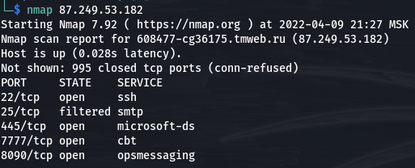
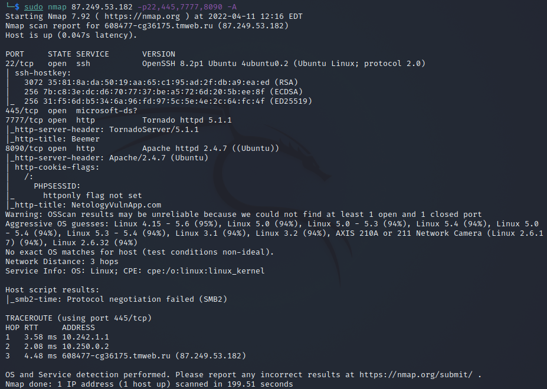
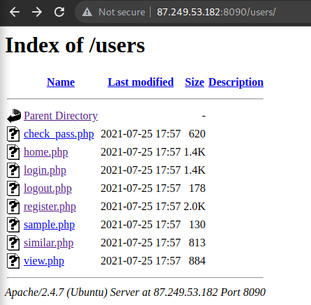

# Lab 3: Web Security

## Task 1: Black Box testing

You are given the IP of the dedicated host that hold vulnerable web applications: `87.249.53.182` Find targets and the way how you can exploit it.

### Port and service scanning

```bash
nmap 87.249.53.182 # scanning common port numbers
```



```bash
# OS and service detection for the observed open ports
sudo nmap 87.249.53.182 -p22,445,7777,8090 -A  
```




**Highlighted results**

- Port 22 is running `OpenSSH 8.2p1 Ubuntu 4ubuntu0.2 (Ubuntu Linux; protocol 2.0) `
  - The OpenSSH version used is not associated with any critical vulnerabilities, so it’s unlikely that we gain initial access through this port.
  - Trying metasploit's module `auxiliary/scanner/ssh/ssh_login` to bruteforce login credentials with common logins gave no results.
- Port 7777 is running `Tornado 5.1.1` (web server)
- Port 8090 is running `Apache 2.4.7` (web server)
- Web server versions are also not associated with critical vulnerabilities


### Port 8090/TCP vulnerabilities

The webpage at `87.249.53.182:8090` hosting ``NetologyVulnApp.com`` is not enforcing the use of HTTPS which means that all data (including user credentials) are transmitted in plaintext and is subject to sniffing attacks. After creating an account, the vulnerabilities listed below were found:

#### 1. Cross Site Scripting (XSS)

**1.1 Stored XSS**

- Guestbook tab contains a form with two fields (name and comment) that takes user input.

  

- User input is not being sanitized, submitting the payload `<script>alert(1)</script>` we can see an alert showing up everytime the page is loaded.

- This can be exploited to inject arbitrary JS code in the application (e.g., to steal user cookies including session IDs and use it to do actions on behalf of users) with a payload similar to this:

  ```html
  
  ```

**1.2. Reflected XSS**

- The search field reflects unsanitized user input, searching for `<script>alert(1)</script>` again showed an alert.

- Although this is less dangerous than reflected XSS, it's still a vulnerability as it allows crafting phishing links on the trusted domain like:

  ```
  http://87.249.53.182:8090/pictures/search.php?query=<URL_ENCODED_JS_PAYLOAD>&x=14&y=13
  ```

- This link when clicked by a user, executes `<URL_ENCODED_JS_PAYLOAD>`  that can also be used to steal cookies, redirect to other webpage, or many other attacks.

#### 2. Unrestricted File Upload

- Upload tab allows uploading arbitrary files without checks.
- This allows
  - Uploading backdoors
    - Example PHP script that opens as a reverse shell: [script](https://github.com/pentestmonkey/php-reverse-shell/blob/master/php-reverse-shell.php). 
  - Remote Code Execution (RCE) by uploading a script that calls `system()`.
  - Uploading phishing websites (e.g., HTML and JS files to redirect users to attacker website)
    - These websites will look trustworthy since the domain they are hosted on is not the attacker's.
- All uploaded files (even the ones uploaded by other users) are stored in `http://87.249.53.182:8090/uploads` and directory listing is enabled.


#### 3. Directory Listing

- Directory Listing is not a vulnerability by itself, unless it allows accessing data useful for the attacker.
- `http://87.249.53.182:8090/users` and `http://87.249.53.182:8090/cart` contains PHP sources from the website, examining this will allow the attacker to discover even more serious vulnerabilities.



#### 4. Guessable/Weak passwords

- In the footer, there are hyperlinks including `Admin` redirecting to Admin login page.


- The admin's credentials were easily guessed and we were able to log in using `username:admin` and `password:admin`


#### 5. Information Exposure through query string in url

Users' uploaded content is accessible by modifying the `userid` parameter in the query string (no checks for being logged as the user).

`http://87.249.53.182:8090/users/sample.php?userid=1`


### Port 7777/TCP vulnerabilities

The webpage at `87.249.53.182:7777` hosting ``BEEMERS`` is also not enforcing the use of HTTPS which means that all data (including user credentials) are transmitted in plaintext and is subject to sniffing attacks).

#### **1. Remote Code Execution (RCE)**

- The server status feature at `http://87.249.53.182:7777/server.html` allows executing arbitrary commands on the server. Example payload: `127.0.0.1 && ls`

  

- **This allows**
  - Opening a reverse shell on the server.
  - Uploading arbitrary content, including phishing websites.
  - Dumping SQLite database `test.db`
  - Viewing server source code `server.py` which makes it a whitebox testing.

 

#### 2. Reflected XSS

- Same vulnerability with the previous website: the search field reflects unsanitized user input, searching for `<script>alert(1)</script>` showes an alert.

- Phishing link:

  ```
  http://87.249.53.182:7777/search?q=<URL_ENCODED_JS_PAYLOAD>
  ```

  

#### 3. Directory Traversal

- Proper access rules for directories and files are not enforced by the webserver.

- We can access `/etc/passwd` for example by the link

  ```
  http://87.249.53.182:7777/read?file=../../../../../../etc/passwd
  ```


#### 4. Unrestricted File Upload

- Upload functionality allows uploading arbitrary files to the server
- Files are stored in `/tmp` directory which we can access using the same trick above with directory traversal.


#### 5. Guessable/Weak passwords

- Poorest admin credentials ever: `username:admin` and `password:admin`

