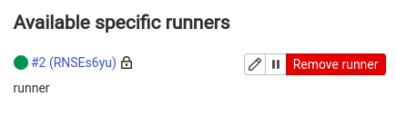

# DevSecOps - Lab 1

## Preparing Environment and Application

1. Implement [application logic](./app/main.go).

2. Write [docker-compose.yaml](./gitlab/docker-compose.yaml) to run a self-hosted GitLab server and runner.

3. Run containers using docker-compose.

   ```bash
   cd gitlab
   docker-compose up -d
   ```

4. Wait for <http://localhost> to become ready, then reset `root` password for GitLab server

   ```bash
   sudo docker exec -it gitlab /bin/bash
   gitlab-rake "gitlab:password:reset" # enter root and a new passowrd
   ```

5. Navigate to <http://localhost>, register a new deployment user

6. Login as root user and navigate to <http://localhost/admin/users?filter=blocked_pending_approval> to approve the newly created user.

7. Login back as the deployment user and create a blank repo.

8. Push changes to GitLab

   ```bash
   git init --initial-branch=main
   git remote add origin http://localhost/milkshakers/lab1.git
   git add -A
   git commit -m "Initial commit"
   git push -u origin main
   ```

   

9. From Settings -> CI/CD -> Runners -> Specific Runners -> Copy token.

10. Exec into runner container to register runner and install docker CLI.

    ```bash
    $ docker exec -it <GITLAB_RUNNER_IMAGE_ID> bash
    gitlab-runner register # url: http://gitlab, token: obtained from UI, type: shell
    curl -sfL -o docker.tgz "https://download.docker.com/linux/static/stable/x86_64/docker-20.10.9.tgz"
    tar -xzf docker.tgz --strip=1 -C /usr/local/bin
    rm docker.tgz
    chmod 666 /var/run/docker.sock
    ```

11. Verify runner is registered in the UI.

    

## Dockerizing application

1. Write [Dockerfile](./app/Dockerfile) for the app, follow best practices:

   - Unprivileged containers are more secure.

   - Use small images (e.g., alpine-based).

   - Copy only necessary files to container.

   - Use a docker linter (e.g., hadolint).

2. Test the built image.

   

## Delivering application

### Build Stage

1. From Settings -> CI/CD -> Variables -> Add the following variables and their values

   ```bash
   CI_REGISTRY_USER
   CI_REGISTRY_PASSWORD
   CI_REGISTRY_IMAGE
   ```

2. Create [gitlab-ci.yml](./.gitlab-ci.yml) with the pipeline to build and push docker image to dockerhub.

3. Push changes to GitLab and verify the pipeline runs successfully and [image is available on dockerhub](https://hub.docker.com/repository/docker/sh3b0/app).

   

### Deployment Stage

#### Case 1: bare metal deployment

0. Prepare a remote VM (e.g., EC2 instance) to be used for application deployment.

1. Exec into GitLab runner again to setup SSH.

   ```bash
   $ docker exec -it <GITLAB_RUNNER_IMAGE_ID> bash
   su gitlab-runner
   ssh-keygen            # keep default path and no passphrase
   cat ~/.ssh/id_rsa.pub # copy public key 
   ```

2. SSH into the deployment server paste the public key into `~/.ssh/authorized_keys`

3. Add a `deploy` stage to [gitlab-ci.yml](./.gitlab-ci.yml) that runs the following commands: this will basically extract the built artifact, send it to the VM, and execute it there directly.

   ```bash
   docker run -d --name app "$CI_REGISTRY_IMAGE"
   docker cp app:/app/build build/
   docker stop app
   docker rm app
   scp build/main <user>@<server-ip>:main
   ssh -t <user>@<server-ip> ./main
   ```

4. Expose port 80 to the public, optionally set a DNS name to the VM. Application should then be accessible at `<server-ip>`

#### Case 2: K8s deployment

1. Install `kubectl` in the GitLab runner.

   ```bash
   $ docker exec -it <GITLAB_RUNNER_IMAGE_ID> bash
   curl -sS -LO "https://dl.k8s.io/release/$(curl -L -s https://dl.k8s.io/release/stable.txt)/bin/linux/amd64/kubectl"
   install -o root -g root -m 0755 kubectl /usr/local/bin/kubectl
   ```

2. Configure kubectl to connect to the cluster. You can copy `~/.kube/config` from host to runner.

3. Add a `deploy` stage to [gitlab-ci.yml](./.gitlab-ci.yml) that runs `kubectl apply -f k8s/deployment.yaml`

4. Run CI and verify application is deployed to k8s.

   
   
