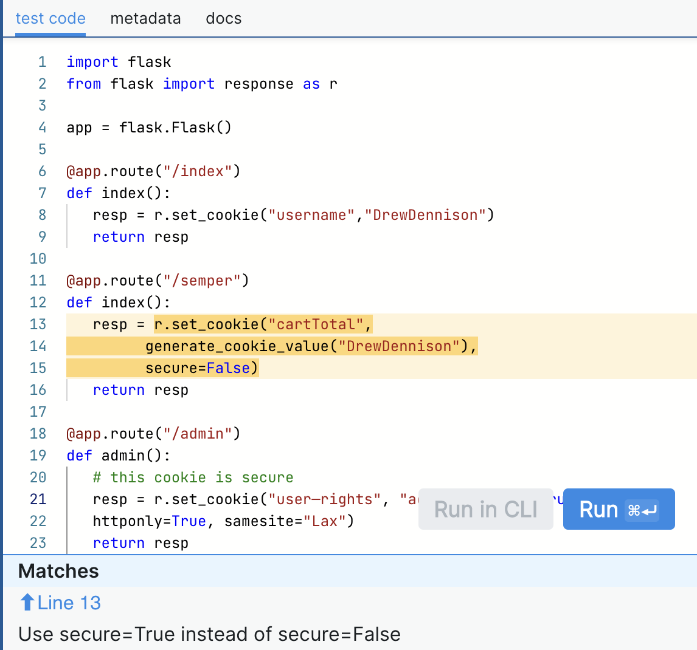
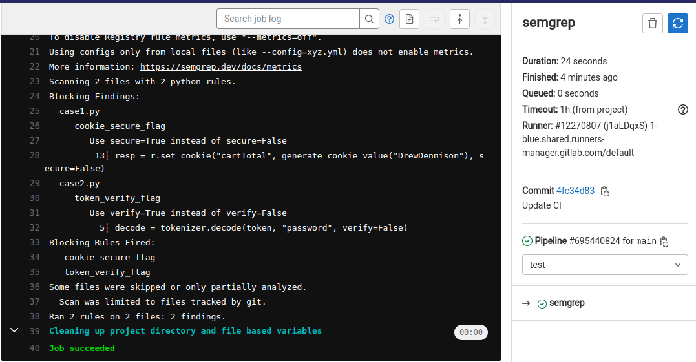

# DevSecOps - Lab 3

## GitLab SAST with Semgrep

1. Deploy GitLab server and runner using [docker-compose.yaml](./gitlab/docker-compose.yaml)

   ```bash
   cd gitlab
   docker-compose up -d
   ```

2. Register runner with `docker` executor and `network_mode = "gitlab_default"` (same steps from previous lab).

3. Create a new blank GitLab repo named `Lab3`.

4. Download <https://github.com/appsecco/dvja> and import it into GitLab.

   ```bash
   git clone https://github.com/appsecco/dvja
   cd dvja
   sudo rm -rf .git/
   ```

5. Create [dvja/.gitlab-ci.yml](./dvja/.gitlab-ci.yml) that uses GitLab SAST to scan code on pushes to main. Use environment variables to override rules for `semgrep` to use `owasp-top-ten` ruleset.

   ```yaml
   # dvja/.gitlab-ci.yml
   stages:
     - test
   
   sast:
     stage: test
   
   include:
     - template: Security/SAST.gitlab-ci.yml
   
   variables:
     SEMGREP_RULES: >-
       p/owasp-top-ten
   ```

6. Push changes to run pipeline

   ```bash
   git init --initial-branch=main
   git remote add origin git@localhost:milkshakers/lab3.git
   git add .
   git commit -m "Initial commit"
   git push -u origin main
   ```

7. Report artifact: [gl-sast-report.json](./gl-sast-report.json)

   

8. Report summary: SQL injection vulnerabilities were found in [`ProductService.java`](./dvja/src/main/java/com/appsecco/dvja/services/ProductService.java) and [`UserService.java`](./dvja/src/main/java/com/appsecco/dvja/services/UserService.java
   ). Relevant lines:

   ```java
   // ProductService.java:48
   Query query = entityManager.createQuery("SELECT p FROM Product p WHERE p.name LIKE '%" + name + "%'");
   
   // UserService.java:75
   Query query = entityManager.createQuery("SELECT u FROM User u WHERE u.login = '" + login + "'");
   ```

9. **Theory**

   > **SAST analyzers:** software that analyzes source code for vulnerabilities without running it. It runs a set of rules against the source code to find common patterns. GitLab offers out-of-the-box integration with common analyzers including `semgrep`.
   >
   > **SAST analyzers' features:** common SAST analyzers support customizable configuration and rulesets, offline mode, scanning one or more projects, and reporting results in JSON.
   >
   > **Post analyzers:** tools/scripts that enrich SAST analyzer reports by adding additional info to the report (e.g., corresponding CWE, corresponding line in the code, and false positive detectors).

## Analysis with Semgrep

### Case 1

```python
import flask
from flask import response as r

app = flask.Flask()

@app.route("/index")
def index():
    resp = r.set_cookie("username", "DrewDennison")
    return resp

@app.route("/semper")
def index():
    resp = r.set_cookie("cartTotal", generate_cookie_value("DrewDennison"), secure=False)
    return resp

@app.route("/admin")
def admin():
    # this cookie is secure
    resp = r.set_cookie("user—rights", "admin", secure=True, httponly=True, samesite="Lax")
    return resp 
```

1. **Where is the vulnerability in the code?** The following line:

   ```python
   resp = r.set_cookie("cartTotal", generate_cookie_value("DrewDennison"), secure=False)
   ```

2. **What is the vulnerability?**

   While setting the cookie, the secure flag is set to false. [OWASP reference](https://owasp.org/www-community/controls/SecureCookieAttribute)

3. **How does it affect the code?**

   When a cookies `secure` flag is set to false, the cookies can be easily observed by unauthorized parties because the cookies will be transmitted in clear text. In our case, when a user access `/semper` end point, they will be sent a cookies from the server in clear text.

4. **Write a `semgrep` rule to detect the vulnerability.**

   ```yml
   rules:
   - id: cookie_secure_flag
     pattern: $VAR.set_cookie(...,secure=False,...)
     message: Use secure=True instead of secure=False
     languages: [python]
     severity: WARNING
   ```

   

### Case 2

```python
import jwt as tokenizer

# JWT Auth bypass
def accept_request():
    decode = tokenizer.decode(token, "password", verify=False)

# JWT algorithm bypass
def accept_another_request():
   decode= jwt.decode(token, "password")
```

1. **Where is the vulnerability in the code?** The following line:

   ```python
   decode = tokenizer.decode(token, "password", verify=False)
   ```

2. **What is the vulnerability?**

   The `verify` flag is set to false when decoding the token.

3. **How does it affect the code?**

   When this flag is set to false, the payload is only decoded but the signature isn't verified. In this case, there's no need to provide the matching key while decoding which may result into a point of exploitation.

4. **Write a `semgrep` rule to detect the vulnerability.**

   ```yml
   rules:
   - id: token_verify_flag
     pattern: $VAR.decode(...,verify=False,...)
     message: Use verify=True instead of verify=False
     languages: [python]
     severity: WARNING
   ```

   

### Gitlab CI

1. Create a new directory named [semgrep](./semgrep) and add the 2 sample codes.

2. Create [semgrep/rules.yaml](./semgrep/rules.yaml) with custom rules for semgrep.

   ```yaml
   rules:
   - id: cookie_secure_flag
     pattern: $VAR.set_cookie(...,secure=False,...)
     message: Use secure=True instead of secure=False
     languages: [python]
     severity: WARNING
   - id: token_verify_flag
     pattern: $VAR.decode(...,verify=False,...)
     message: Use verify=True instead of verify=False
     languages: [python]
     severity: WARNING
   ```

3. Create [semgrep/.gitlab-ci.yml](./semgrep/.gitlab-gi.yml) to scan code using the custom rules on push.

   ```yaml
   semgrep:
     image: returntocorp/semgrep
     script:
       - semgrep --config rules.yaml .
     only:
       - main
   ```

4. Create a new GitLab repo, push the files from semgrep directory to run the pipeline

   

5. We can see the two custom rules were applied to detect and report the vulnerabilities in both cases.

6. Explain how and why `semgrep` is different from a normal `grep`

   - `semgrep` (semantic `grep`) is a tool used for analyzing static code to enforce code standards from a defined set of rules mostly for detecting bugs, vulnerabilities, and other dependencies.

   - `grep` is a command line utility that finds if a certain text match a particular regular expression in a group of files.

   - `grep`  scans code *syntax*, while `semgrep` scans code *semantics*.
