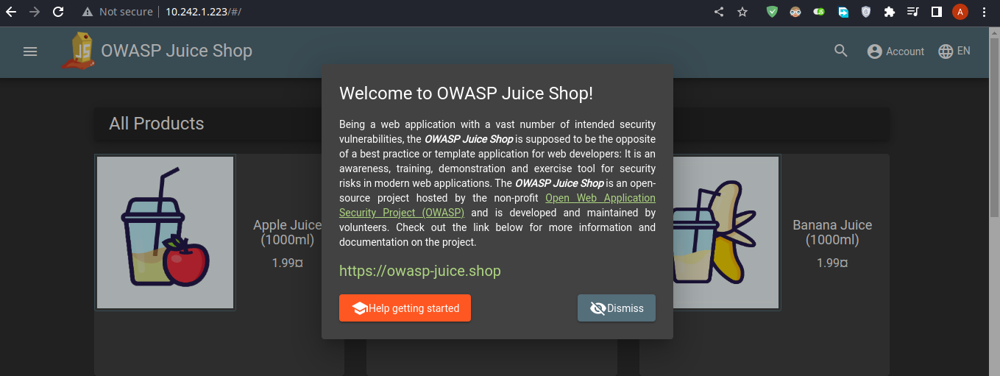
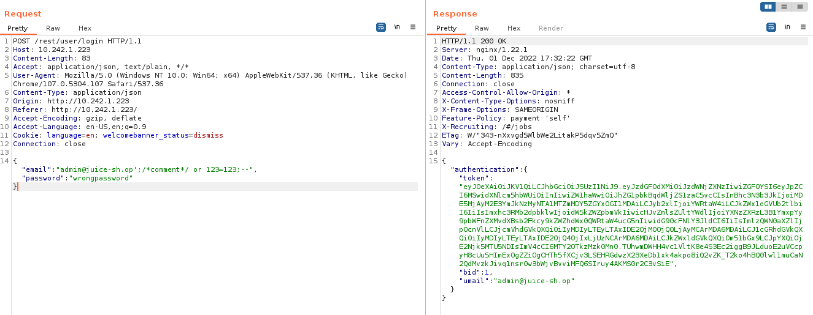

# DevSecOps - Lab 6

## Construct a defense strategy

1. Deploy [bkimminich/juice-shop](https://hub.docker.com/r/bkimminich/juice-shop) and [owasp/modsecurity-crs:nginx](https://hub.docker.com/r/owasp/modsecurity-crs/) using a [`docker-compose.yaml`](./docker-compose.yaml) file

   ```bash
   docker-compose up
   ```

2. **Remarks:**
   - The above command deploys the vulnerable Juice-Shop application and ModSecurity Web Application Firewall (WAF) configured to proxy requests to the application. Applications are deployed as containers in the same docker network.
   - The WAF uses an `nginx` server with `modsecurity` addon configured with the default Core Rule Set (CRS). The default rules in the CRS block common attack patterns that correspond to OWASP top 10 known vulnerabilities.
   - ModSecurity image uses the default recommended configuration available [here](https://github.com/coreruleset/modsecurity-crs-docker/blob/develop/src/etc/modsecurity.d/modsecurity-override.conf). The configuration is used to filter out malicious injections (e.g., XSS, SQLi), set some limits on file upload, etc.

3. Give the IP address of the machine to the attacking team. Add a firewall rule to allow `80/tcp` if needed. The attacking team should be on the same LAN.

## Let’s pawn the adversary

1. Get the IP address of the adversary machine. Their deployed application is Juice-Shop.

2. Service detection with `nmap` shows an `nginx/1.22.1` server deployed.

   

3. Accessing the target IP at port 80 from browser shows the main webpage of OWASP Juice Shop.

   

4. Without WAF, it's possible to login as the first user (`admin`) using SQL injection. The following payload is typically submitted in email login field with any password.

   ```sql
   ' OR TRUE --
   ```

5. The SQL query to get user resolves to:

   ```sql
   SELECT * FROM Users WHERE email = '' OR TRUE -- AND password = '<PASSWORD_HASh>' AND deletedAt IS NULL
   ```

6. But now that ModSecurity is deployed, trying the same trick yields a 403 Forbidden error from the nginx server.

   

7. It seems that the default rules for SQL injection filtering used by ModSecurity with paranoia level 1 is not quite strong. A carefully crafted SQLi payload was able to break the regex.

   ```bash
   admin@juice-sh.op';/*comment*/ or 123=123;--
   ```

8. The above payload used SQL comments and a semicolon separator to break the regex check against SQL injection. The screenshot shows a successful login attempt as admin user using SQL injection that bypasses WAF (`nginx` server used by WAF can be seen in the response header).

   
