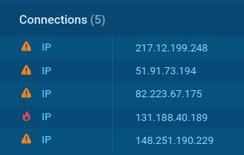

# Sandbox Malware Analysis

## Setting up a host-only network

- **Host:** Ubuntu 20.04 LTS running QEMU-KVM with virt-manager
  
  - Create an empty bridge `sudo brctl addbr br0`
  - Add static to the bridge `sudo ip a add 172.22.0.1/16 dev br0` 
  - Attach the guest to the bridge ethernet interface (from virt-manager GUI)
- **Guest:** Kali Linux 2021.4a
  
  - Add static ip to the guest `sudo ip a add 172.22.0.2/16 dev eth0`
  - Gateway should already be configured, but we can make sure using `sudo ip route add 172.22.0.0/16 via 172.22.0.1 dev eth0`
  
- Now host and guest are connected through `br0` but guest cannot access the internet (same as Host-Only adapter in VirtualBox) and guest is not part of host's network.

- **Reachability check**

  

## Sandbox analysis on Any.Run

- Downloaded the very popular ransomware [WannaCry](https://en.wikipedia.org/wiki/WannaCry_ransomware_attack) from [TheZoo](https://github.com/ytisf/theZoo/tree/master/malware/Binaries)

- Tested the executable on [Any.Run](https://any.run) sandbox with Windows 7 ([public run](https://app.any.run/tasks/a5006503-43b2-43cd-a028-164b8268c973))

  

- The executable used Windows cmd and VBScripts to download, grant permissions, and execute `WanaDecryptor.exe` which was identified as malicious by the any.run service.

  

- Several Indicators of Compromise (IoCs) were collected and dumped, including hashes of the files mentioned and the remote addresses used by the ransomware for Command and Control (C&C).

  

- The executable utilized Tor anatomized network for remote communications.

  

- Checking the Mitre Att&ck Matrix, it turns out the executable also executed a couple more malicious behaviors including:

  - The installation of a malicious browser extension.

  - Creation of files in MSword Startup folder.

  - Stealing credentials from web browser storage.

  - Deleting shadow copies of files to prevent recovery of data (command `vssadmin delete shadows /all /quiet`)

     

## Sandbox analysis on [hybrid-analysis](https://hybrid-analysis.com)

- Downloaded the banking trojan and malware loader [Emotet](https://en.wikipedia.org/wiki/Emotet) from [TheZoo](https://github.com/ytisf/theZoo/tree/master/malware/Binaries). It's typically hidden in word/pdf documents and when executed, runs a script that downloads more malicious files used for spying and other related activities.

- File was run on the service sandbox and metadata was collected. File hashes and extracted files were also checked for known malware hashes and a match was found.

  

- The service sent the file to several anti-virus vendors for detection, all of which marked the file as malicious and detected the malware.

  

- Network behavior was also analyzed to find contacted hosts and resolved DNS queries.

  

- Related attack vectors were identified and the corresponding IoCs were listed.

  

## Tips for creating a hard-to-detect sandboxing environment

- Many types of malware use sandbox detection methods and may change behavior upon detecting that they are being analyzed. To avoid such behavior, it's generally advised to:

  - Have realistic system specifications for the VM (e.g., machine with < 1GB of RAM indicate a visualized environment).
  - Remove VM guest additions (can be detected by the malware).
  - Use the OS for some time (a fresh installation with no basic apps installed and no logs indicate a testing environment).
  - Emulate a real Internet connection if needed (e.g.,using FakeNet) and capture the packets instead of sending them.

  
