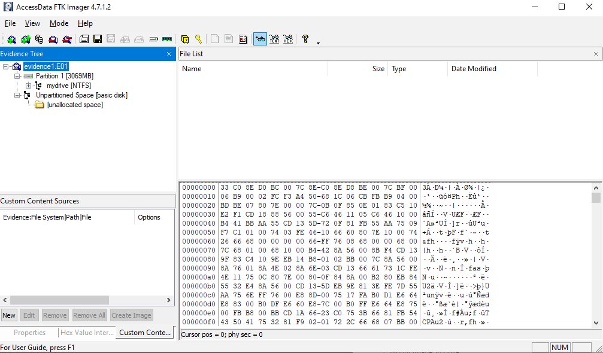
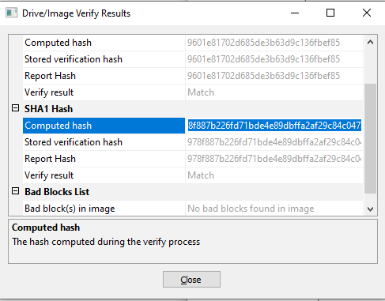
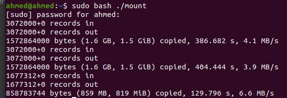

# Lab 7: Forensics

## Theoretical questions

- **Write a one-line description, or note a useful feature for the following tools included in CAINE: Guymager, Disk Image Mounter, dcfldd / dc3dd, kpartx.**
  - **Guymager:** creates forensic images and performs disk cloning.
  - **Disk Image Mounter:** mounts ISO contents so it can be viewed.
  - **dcfldd/dc3dd:** enhanced versions of UNIX dd (used to convert/dump disk images).
  - **kpartx:** enhanced version of UNIX partx (used to create device maps).

- **Why would you use a forensic distribution and what are the main differences between it and a regular distribution?**
  - Forensic distributions come preloaded with the necessary software and environment for investigation.
  - It also provides features such as opening all block devices (e.g., USBs) in read-only mode by default, this ensures that no write operations will be done accidently or by the OS, thus preserving the evidence integrity.
- **When would you use a live environment and when would you use an installed environment?**
  - Installed environment is useful for mass storage and in cases where you need to preserve content or work for later.
  - Live environment is useful for quick, one-time tasks where you need a fresh minimal environment.
- **What are the policies of CAINE?**
  - Never mount devices automatically, and when you mount, make it read-only.

## Prerequisites

- Downloaded evidence file (.E01)
- Downloaded FTK imager (4.7.1.2)
- Downloaded CAINE 12.4 iso image
- Created a bootable USB of the iso using UNetBootin.
- Downloaded log2timeline/plaso version 20211229 from github.

## Imaging

- **Loading the image**:

  - FTK Imager -> Add evidence item -> select the downloaded evidence.

    

- File -> Image Mounting


- **Dumping a USB image**

  - File -> Create disk image -> Physical drive -> Select the USB you want to image -> Add destination -> Write evidence information (case number, etc.)

    

    

  - Image was created and verified, we also obtained MD5 and SHA-1 hashes of the image which we can send to other teams so that they can verify the image after loading it as we showed above.

     
    
  - Dumped the image to USB using dd
  
    ```
    ( dd if=img.001
      dd if=img.002
      dd if=img.003
    ) > /dev/sdb1
    ```
  
    
    
  - Ran `log2timeline.py` on the dumped image files.
  
    ```
    log2timeline.py --storage-file timeline.plaso .
    ```
  
    
  
    

## Verification

6. How can you make your dumped USB image verifiable?
   - After dumping the USB to an evidence file, we get the hash of the image and send the hash to other along with the dumped image.
7. When you receive a dumped USB image, how can you verify it's integrity?
   - A receiving party can hash the image after loading it on their system and compare the result to check integrity.


## Technical analysis

8. Mount dumped image in read-only mode.

   - Mounted the USB on CAINE.

9. Analyze the image.

   

   - Image size: 4,004,511,744 bytes ~= 4GB
   - Partition type, does it use MBR/GPT? It uses MBR/

10. Using the dumped timeline, write what you think has happened on the USB?

    - Used CAINE autopsy to analyze the evidence file.
    - USB contained some files from Windows with user "Thomas Ehrhart" with many logs and data (images, flash files, and executables)
    - Seems like the owner has VeraCrypt and TrueCrypt installed, which might indicate a hidden container in the file system.
    - We can do further analysis to verify if such container exists and whether it might have relevant data.
    

