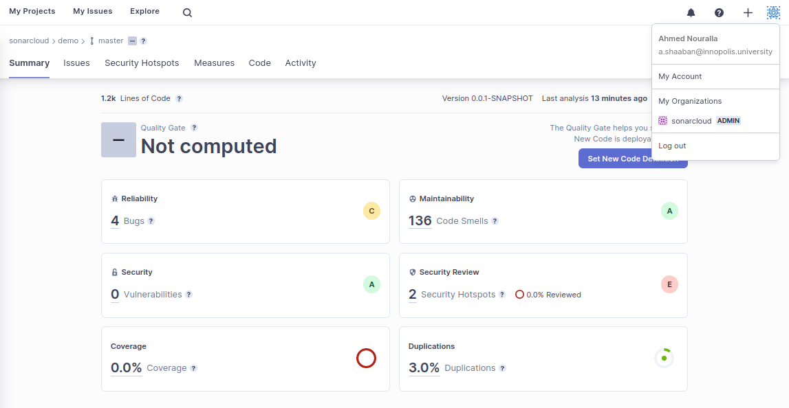

# Lab 2 - Software Quality and Reliability

## SonarQube Scan

1. Run SonarQube in a docker container using the following command

   ```bash
   docker run -d --name sonarqube -e SONAR_ES_BOOTSTRAP_CHECKS_DISABLE=true -p 9000:9000 sonarqube:latest
   ```

2. Login at <http://localhost:9000> with credentials: `admin:admin` and change password as requested.

3. From the Web UI, create a project manually and setup local repository analysis and obtain the analysis token.

4. Run the analysis by executing the command

   ```bash
   ./mvnw clean verify sonar:sonar \
     -Dsonar.projectKey=lab2_nouralla \
     -Dsonar.host.url=http://localhost:9000 \
     -Dsonar.login=sqp_813b3a28a8edf15d23cff9765fb56d4cdcfebea3
   ```

5. The page should automatically refresh and show the analysis results

   

## SonarCloud Scan

1. Sign up for an account on <https://sonarcloud.io/> using GitLab.

2. Create a project and an organization at <https://sonarcloud.io/projects/create>

3. Add the following environment variables to GitLab.

   ```bash
   SONAR_TOKEN=<TOKEN>
   SONAR_HOST_URL=https://sonarcloud.io
   ```

4. Add the following property to [pom.xml](./pom.xml)

   ```xml
   <properties>
     <sonar.organization>project-43972561-bot-8b5249065b413969</sonar.organization>
   </properties>
   ```

5. Update [.gitlab-ci.yml](./.gitlab-ci.yml) to add SonarCloud scan stage.

   ```yaml
   stages:
     - build
     - linter
     - sonar_cloud
   
   build:
     stage: build
     image: maven
     script:
       - chmod +x mvnw
       - ./mvnw package
     artifacts:
       paths:
         - target/main-0.0.1-SNAPSHOT.jar
   
   linter:
     stage: linter
     image: maven
     script:
       - chmod +x mvnw
       - ./mvnw spotbugs:spotbugs
     dependencies:
       - build
   
   sonar_cloud:
     stage: sonar_cloud
     variables:
       SONAR_USER_HOME: "${CI_PROJECT_DIR}/.sonar"
       GIT_DEPTH: "0"
     image: maven
     allow_failure: true
     cache:
       key: "${CI_JOB_NAME}"
       paths:
         - .sonar/cache
     script:
       - >
         ./mvnw package sonar:sonar \
           -Dsonar.projectKey=project-43972561-bot-8b5249065b413969_lab2-nouralla \
           -Dsonar.projectName=project-43972561-bot-8b5249065b413969_lab2-nouralla \
           -Dsonar.host.url=${SONAR_HOST} \
           -Dsonar.login=${SONAR_TOKEN} \
           -Dsonar.sources=./src/main/java/
     only:
       - master
   ```

6. Push code to run the pipeline. Check results in SonarCloud.

   
