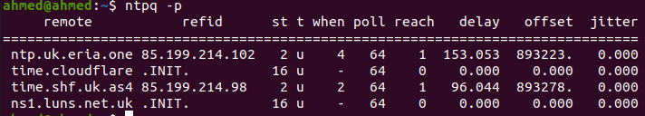

# SNA Lab 9: Nginx and NTP

## Exercise 1

Configure static web page and generate SSL certificate (certificate with your own domain name) and configure it in the web server, enable redirection from HTTP to HTTPS. Show you configuration of nginx and certificate used (make screenshots from the browser)

> 1. Install nginx and verify it's installed and working
>
>    ````bash
>    $ apt-get update
>    $ apt-get install nginx
>    $ nginx -v
>    $ systemctl status nginx
>    ````
>
> 2. Allow nginx through firewall.
>
>    ```bash
>    $ ufw allow 'nginx full'
>    ```
>
> 3. Make sure the webpage is working at `http://127.0.0.1`
>
>    
>
> 4. Create an entry for the website in `/etc/hosts`, it can look like this for a locally hosted website.
>
>    ```bash
>    127.0.0.1	ahmednouralla.com	www.ahmednouralla.com
>    ```
>
> 5. Creating and configuring my domain `ahmednouralla.com`
>
>    1. Create a directory for the domain with the appropriate permissions.
>
>       ```bash
>       $ mkdir -p /var/www/ahmednouralla.com/html
>       $ sudo chown -R $USER:$USER /var/www/ahmednouralla.com
>       $ sudo chmod -R 755 /var/www/ahmednouralla.com
>       ```
>
>    2. Creating HTML file at `/var/www/ahmednouralla.com/html/index.html` for the home page, with my website homepage.
>
>    3. Create configuration file for the domain at `/etc/nginx/sites-available/ahmednouralla.com` with the following content
>
>       ```bash
>       # Server block to redirect all http traffic to use https
>       server {
>           listen 80;
>           server_name ahmednouralla.com www.ahmednouralla.com;
>           return 301 https://ahmednouralla.com$request_uri;
>       }
>       
>       # Server block to configure https
>       # Certificates created from previous lab are copied to /etc/nginx/ssl
>       server {
>           listen              443 ssl;
>           server_name         www.ahmednouralla.com	ahmednouralla.com;
>           ssl_certificate     /etc/nginx/ssl/domain.crt;
>           ssl_certificate_key /etc/nginx/ssl/domain.key;
>       	root /var/www/ahmednouralla.com/html;
>       	index index.html index.htm;
>       }
>       ```
>
>    4. Restart nginx service to apply changes
>
>       ```bash
>       $ systemctl restart nginx
>       ```
>
>    5. Check the redirection works by typing `ahmednouralla.com` in the webbrowser.
>
>       
>
>       

<div style="page-break-after: always; break-after: page;"></div>

## Exercise 2

Set maximum file upload limit to 1GB on nginx server.

> - Add the following line to `/etc/nginx/nginx.conf` inside `http` block.
>
>   ```bash
>   client_max_body_size 1024M;
>   ```
>
> - Then `systemctl restart nginx`


## Exercise 3

Configure your machine synchronization with any NTP server located in the United Kingdom.

> 1. Install NTP `apt install ntp`
>
> 2. Edit the configuration file at `/etc/ntp.conf`
>
> 3. Comment out (#) Ubuntu servers define by the following lines
>
>    ```
>    pool 0.ubuntu.pool.ntp.org iburst
>    pool 1.ubuntu.pool.ntp.org iburst
>    pool 2.ubuntu.pool.ntp.org iburst
>    pool 3.ubuntu.pool.ntp.org iburst
>    
>    ```
>
> 4. Add NTP servers from UK.
>
>    ```
>    server 0.uk.pool.ntp.org prefer iburst
>    server 1.uk.pool.ntp.org prefer iburst
>    server 2.uk.pool.ntp.org prefer iburst
>    server 3.uk.pool.ntp.org prefer iburst
>    ```
>
> 5. Restart NTP service `sudo service ntp restart`
>
> 6. Check current synchronization status using `ntpq -p`
>
>    

