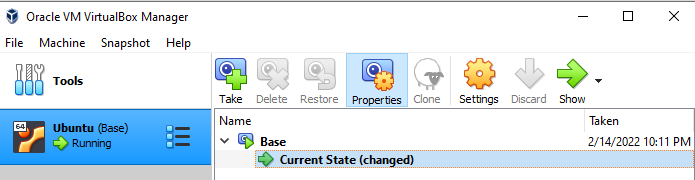
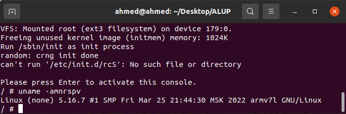
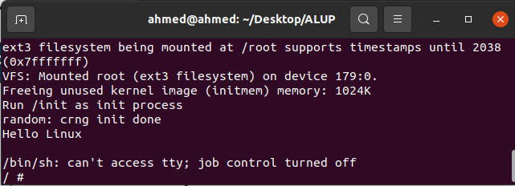

# Task 1 - Booting the Kernel

## Task

Compile and boot the Linux kernel for ARM architecture using QEMU for emulation and u-boot as the bootloader.

## **Prepared Ubuntu VM**




## **Prerequisites**

```bash
sudo apt install git make qemu qemu-system-arm build-essential libncurses-dev bison flex libssl-dev libelf-dev dwarves gcc-arm-linux-gnueabihf
```


## Set a build directory

Will put all required components there.

```bash
export BUILD=/home/ahmed/Desktop/ALUP/
```


## **Compiling u-boot from source**

```bash
git clone https://github.com/u-boot/u-boot
cd u-boot
git checkout v2022.01
export ARCH=arm
export CROSS_COMPILE=arm-linux-gnueabihf-
make vexpress_ca9x4_defconfig O=./u-boot-build
make -j $(nproc) O=./u-boot-build
```

```bash
cp -r ./u-boot-build $BUILD
```


## **Run u-boot as kernel**

```bash
qemu-system-arm -M vexpress-a9 -kernel u-boot-build/u-boot -m 512M -nographic
```


## **Compile kernel for vexpress**

Download and extract [linux-5.18.7](https://cdn.kernel.org/pub/linux/kernel/v5.x/linux-5.16.7.tar.xz)

```bash
export ARCH=arm
export CROSS_COMPILE=arm-linux-gnueabihf-
make vexpress_defconfig O=./linux-build
make -j $(nproc) O=./linux-build
```


```bash
sudo cp -r ./linux-build $BUILD
```


## Compile BusyBox

Download and extract [BusyBox-1.35.0](https://busybox.net/downloads/busybox-1.35.0.tar.bz2)

```bash
CROSS_COMPILE=arm-linux-gnueabihf- make defconfig O=./busybox-build
CROSS_COMPILE=arm-linux-gnueabihf- make menuconfig O=./busybox-build
```

Settings --> Build Options --> [*] Build BusyBox as a static binary (no shared libs)

```bash
CROSS_COMPILE=arm-linux-gnueabihf- make -j $(nproc) O=./busybox-build
CROSS_COMPILE=arm-linux-gnueabihf- make install O=./busybox-build
```

```bash
cp -r ./busybox-build $BUILD
```


## Create rootfs

```bash
cd $BUILD
mkdir rootfs
cp -r busybox-build/_install/* rootfs/
```

```bash
# Creating tty (terminal chatacter devices)
cd rootfs/dev
mknod tty1 c 4 1  
mknod tty2 c 4 2  
mknod tty3 c 4 3  
mknod tty4 c 4 4
```

```bash
# Creating file system image
cd $BUILD
dd if=/dev/zero of=arm.img bs=1M count=32  
mkfs.ext3 arm.img  
```

```bash
# Copy rootfs to the image
mkdir tmpfs
sudo mount -t ext3 -o loop arm.img tmpfs  
sudo cp -r rootfs/*  tmpfs/
sudo umount tmpfs
```


## :running: Kernel

```bash
qemu-system-arm
    -M vexpress-a9
    -m 512M
    -dtb linux-build/arch/arm/boot/dts/vexpress-v2p-ca9.dtb
    -kernel linux-build/arch/arm/boot/zImage
    -nographic
    -append "root=/dev/mmcblk0 rw console=ttyAMA0"
    -sd arm.img
```




## Create initramfs

We can specify our `init` script to run as the kernel boots

```bash
nano rootfs/init
```

```bash
#!/bin/sh
mount -t proc none /proc
mount -t sysfs none /sys
echo -e "Hello Linux\n"
exec /bin/sh
```

````bash
sudo chmod +x rootfs/init
````

Then create `arm.img` [as above](#Create-rootfs)

```bash
qemu-system-arm
    -M vexpress-a9
    -m 512M
    -dtb linux-build/arch/arm/boot/dts/vexpress-v2p-ca9.dtb
    -kernel linux-build/arch/arm/boot/zImage
    -nographic
    -append "root=/dev/mmcblk0 rw console=ttyAMA0 init=/init"
    -sd arm.img
```





// `<Ctrl>a x` to terminate. 
