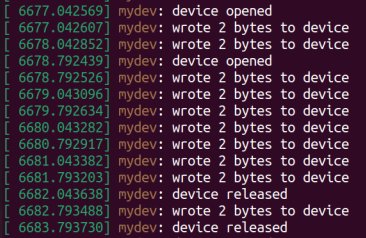

# Task 3 - dynamic memory allocation

## Task

- Add dynamic memory allocation to the kernel module from task 2.
- Add `ioctl()` call support to change queue size dynamically (maximum size is not limited, return error on failure).
- Add concurrent access to your module.

## Makefile
- To compile and load module: `sudo make`
- To run a simple test: `make test`
- To unload module and clean working directory: `sudo make clean`

## Tests

### Simple test

- Stack starts with `stack_size = 1` and dynamically doubles as more elements get inserted. 

  

- Kernel logs: `sudo dmesg -w`

  

### ioctl test

- Userspace application in `ioctl_test` directory can be used to manually extend the stack size by performing a write operation on the device using `ioctl()`

  

- Kernel logs

  

### Concurrency test

- Multiple processes can access the device, but only one process is allowed to be reading/writing from the shared stack at a time.

- The other process will wait while keeping the CPU spinning
  - This is achieved through the use of spin locks.
  - This is ok to use when the estimated waiting time is typically not large.
  
- In the example tester code there are two C files, compile and run them one after another in the background.
  - p1 will open the device and write `1` every second (it will do it 5 times).
  - p2 will open the device and write `2` every second (it will do it 5 times).
  - Reading the device at the end we can see the alternating sequence of 1's and 2's
  
- Output shows that the two processes were able to access the device at the same time and use the shared stack exclusively.

  

- Kernel logs: `sudo dmesg -w`

  

