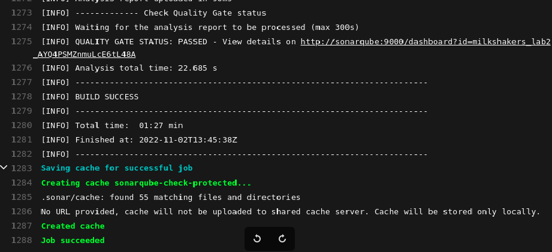
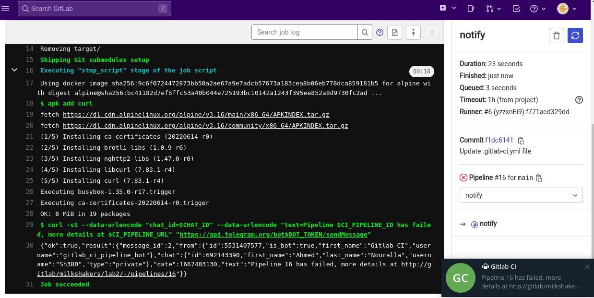

# DevSecOps - Lab 2

## Preparing Environment

1. Modify [docker-compose.yaml](./gitlab/docker-compose.yaml) from previous lab to run `sonarqube` in the same network along with  `gitlab` and `runner`.

   ```bash
   cd gitlab
   docker-compose up -d
   ```

2. This time, use the `docker` executor when registering runner

   ```bash
   $ docker exec -it <GITLAB_RUNNER_IMAGE_ID> bash
   gitlab-runner register # url: http://gitlab, token: obtained from UI, type: docker
   curl -sfL -o docker.tgz "https://download.docker.com/linux/static/stable/x86_64/docker-20.10.9.tgz"
   tar -xzf docker.tgz --strip=1 -C /usr/local/bin
   rm docker.tgz
   chmod 666 /var/run/docker.sock
   ```

3. From runner config (host path: `/var/lib/docker/volumes/gitlab_gitlab-runner-config/_data/config.toml`), add `network_mode = "gitlab_default"` under ``[runners.docker]`` to add the containers created from CI to the compose network.

4. Create a new blank gitlab repo named `Lab2`.

5. Download <https://github.com/appsecco/dvja> and import it into gitlab.

   ```bash
   git clone https://github.com/appsecco/dvja
   cd dvja
   sudo rm -rf .git/
   git init --initial-branch=main
   git remote add origin git@localhost:milkshakers/lab2.git
   git add .
   git commit -m "Initial commit"
   git push -u origin main
   ```

6. Navigate to <http://localhost:9000> and login to SonarQube with default credentials `admin:admin`, it will ask to change admin password.

## Analysis

1. From Gitlab User Settings -> Access Tokens -> Create a token named `sonarqube` with `api` permission.

2. From SonarQube homepage (<http://localhost:9000>), set up global configuration for GitLab named `gitlab`, the API URL is `http://gitlab/api/v4/`, and the personal access token you just obtained.

3. Follow the instructions to setup SonarQube integration, namely:

   - Adding the property `<sonar.qualitygate.wait>true</sonar.qualitygate.wait>` to [pom.xml](./dvja/pom.xml)

   - Adding [.gitlab-ci.yml](./dvja/.gitlab-ci.yml)

   - SonarQube account -> Security -> generate a `Global Analysis Token` named `gitlab`.

   - Gitlab Settings -> CI/CD -> Variables -> Add the token and SonarQube host URL.

     

4. Push changes to run the pipeline

   

5. Check analysis results from SonarQube. Application looks *damn* vulnerable.

   

6. Theory

   > - **Quality Profile:** defines the rules to be applied for SAST, SonarQube has built-in quality profiles for supported language. These were the ones used to find the issues shown in the analysis report.
   >
   > - **Quality Gate:** enforces security checks by blocking application builds until certain conditions are met. SonarQube has built-in quality gate that does not pass new code if:
   >
   >   ```bash
   >   Coverage                    is less than     80.0%
   >   Duplicated Lines (%)        is greater than  3.0%
   >   Maintainability Rating      is worse than    A
   >   Reliability Rating          is worse than    A
   >   Security Hotspots Reviewed  is less than     100%
   >   Security Rating             is worse than    A
   >   ```

7. From SonarQube UI -> Quality Gate -> Create a quality gate for the project.

    

8. Rerun the CI, we see the quality gate failed the pipeline as the project contains 120 > 115 issues.

   

   

## Remediation

### Fixing 5 major issues

1. There were some issues in `Constant.java` for missing a private constructor to hide the implicit public one. Though we didn't have a constructor to our utility class, Java implicitly added a default public one. Thus, enabling the API users to create an instance of it. We can now add one eventhough we will never really use this private constructor:

   ```java
   public class Constant {
   
      //Fix Private Constructor issue
      private Constant () {
         throw new UnsupportedOperationException("This is a utility class and cannot be instantiated");
      }
   
      public static String SESSION_USER_HANDLE = "USER";
   }
   ```

2. The variable `SESSION_USER_HANDLE` in `Constant.java` had an issue also becuase it was declared as `public static` without declaring final. It's always advisable to make it final. The solution was below:

   - Solution:

   ```java
   public static final String SESSION_USER_HANDLE = "USER";
   ```

3. Constant names should comply with a naming convention issue:

   Since the `SESSION_USER_HANDLE` was not declared as `final` before, there was an issue to match regular expression `^a-z a-za-z0-9*$`. Since now we declared it as `final`, the constant name will remain as it is in the format : `^[A-Z][A-Z0-9]*(_[A-Z0-9]+)*$`. Reference: <https://rules.sonarsource.com/java/RSPEC-115)>

4. There was an issue of not providing the parametrized type for `Map results = new HashMap();`. We added the results to be parametrized as `Map<String,Object> results = new HashMap<String,Object>();`.

5. Added `@Override` annotation for `execute()` method in `Home` class. This helps creating a warning if the method is not actually overriding anything.

### Rerunning CI



### Telegram integration

1. Create a bot using <https://t.me/botfather>

2. Add the variables `CHAT_ID` and `BOT_TOKEN` to gitlab variables.

3. Modify [.gitlab-ci.yml](./dvja/.gitlab-ci.yml) to send a message on pipeline failure.

4. Test the notify stage

   
