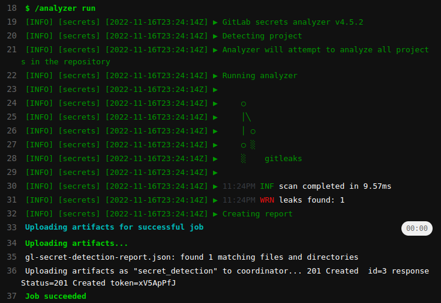
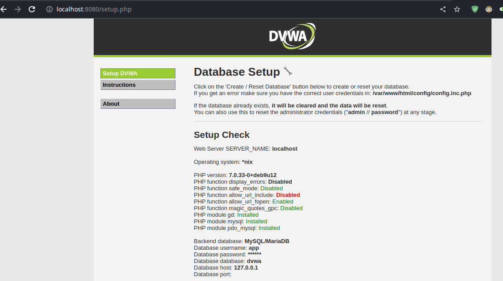
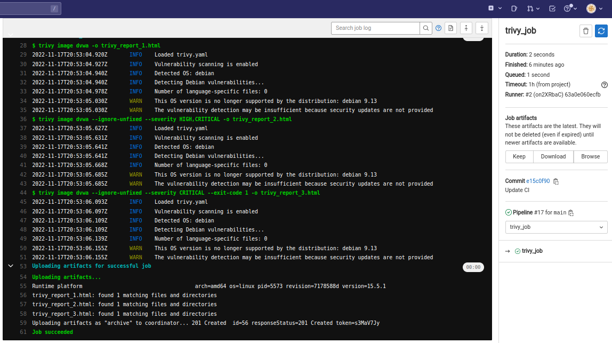

# DevSecOps - Lab 4

## Secret detection with GitLab CI

1. Deploy GitLab server and runner with `docker-compose`.

   ```bash
   cd gitlab
   docker-compose up -d
   ```

2. Register runner as explained in previous labs. Use `shell` executor.

3. Create [`project/.env`](./project/.env) with some secrets.

4. Create [`project/.gitlab-ci.yml`](./project/.gitlab-ci.yml) with the following content

   ```yaml
   include:
     - template: Jobs/Secret-Detection.gitlab-ci.yml
   ```

5. Create a repo from GitLab UI and push code to trigger CI.

   ```bash
   cd project
   git init --initial-branch main
   git remote add origin http://localhost/milkshakers/project.git
   git add -A
   git commit -m "Initial commit"
   git push --set-upstream origin main
   ```

6. Pipeline results

   

7. We can see from the [analysis report](./reports/gl-secret-detection-report.json) (pipeline artifact) that GitLab detected only two secrets: The private RSA key and GitLab PAT.

   - The source code file (`.env`) was scanned against the default `gitleaks` [rules](https://github.com/zricethezav/gitleaks/blob/master/config/gitleaks.toml). These rules included regular expressions for GitLab PAT and Private Keys, but not other secrets in the file.
   - To ignore the detected secret, add a comment `#gitleaks:allow` next to the secret.

8. After ignoring GitLab PAT, we can see the pipeline only detected one secret.

   

9. **To enable full history secret detection**, add the following block to [`.gitlab-ci.yml`](./project/.gitlab-ci.yml). This is important since a secret may have been committed once then removed in a later commit. The secret is still leaked and can be extracted from git history. Without a full history scan, `gitleaks` will not detect such secrets.

   ```bash
   secret_detection:
      variables:
         SECRET_DETECTION_HISTORIC_SCAN: "true"
   ```

10. **Best practices to follow in secret management and secret storage.**

- Never commit secrets to version control system.
- If secrets need to be stored remotely, use encryption at rest.
- When working with cloud and containers, it's better to use a secret injector such as [vault](https://www.vaultproject.io/) to inject secrets into running containers instead of baking them into the container.
- When providing secrets in CLI, prefer interactive mode over specifying the secret inside the command (since it will be saved in shell history).

## Dependency analysis

1. Clone [DVWA](https://github.com/digininja/DVWA)

   ```bash
   mkdir app
   cd app
   git clone https://github.com/digininja/DVWA
   cd DVWA
   sudo rm -rf .git/
   ```

2. Dockerize `dvwa` by creating a [Dockerfile](./app/Dockerfile) and a couple of configuration scripts for running `apache2`  web server and a `mysql` database. For this task, I referred to [opsxcq/docker-vulnerable-dvwa](opsxcq/docker-vulnerable-dvwa)

3. Build and test the image. Default login credentials are `admin:password`

   ```bash
   docker build -t dvwa .
   docker run -p8080:80 dvwa
   ```

   

4. Exec into `gitlab-runner` to install `syft` and `grype`

   ```bash
   curl -sSfL https://raw.githubusercontent.com/anchore/syft/main/install.sh | sh -s -- -b /usr/local/bin
   
   curl -sSfL https://raw.githubusercontent.com/anchore/grype/main/install.sh | sh -s -- -b /usr/local/bin
   ```

5. Create [`app/.gitlab-ci.yml`](./app/.gitlab-ci.yml) that builds the docker image for DVWA, downloads and runs `syft`  SBOM generator and `grype` scanner which uses the generated SBOM.

   ```yaml
   stages:
     - build_job
     - syft_job
     - grype_sbom_job
   
   build_job:
     stage: build_job
     script:
       - docker build -t dvwa .
     only:
       - main
   
   syft_job:
     stage: syft_job
     script:
       - syft docker:dvwa -o json=sbom.json -o text=syft_report.txt
     artifacts:
       untracked: true
       paths:
         - syft_report.txt
     only:
       - main
   
   grype_sbom_job:
     stage: grype_sbom_job
     script:
       - grype sbom:./sbom.json -o table > grype_report.txt
     dependencies: 
       - syft_job
     artifacts:
       paths:
         - grype_report.txt
     only:
       - main
   ```

6. Push code to a newly-created GitLab repository named `dvwa`.

   ```bash
   cd app
   git init --initial-branch main
   git remote add origin http://localhost/milkshakers/dvwa.git
   git add -A
   git commit -m "Initial commit"
   git push --set-upstream origin main
   ```

7. Check pipeline status

   

   

8. [Syft report](./reports/syft_report.txt) shows all the layer hashes from the built docker image as well as dependencies used by the DVWA including `apache2`, `mysql`, `php`, and many others. Syft used `dpkgdb-cataloger` to detect those dependencies and shows the used versions.

9. [Grype report](./reports/grype_report.txt) used the JSON report generated by `syft` to analyze DVWA dependencies. The report shows an extensive list of all the vulnerable dependencies used, their corresponding CVEs, severities, and the version in which the vulnerability was fixed, or whether it was flagged as `won't fix`.

10. Reports from `syft` and `grype` can be used by security analysts or automated tools to bump versions of vulnerable dependencies or remove/replace them in the application source code.

11. Exec into `gitlab-runner` and install `trivy`

    ```bash
    apt-get update
    apt-get install wget apt-transport-https gnupg lsb-release
    wget -qO - https://aquasecurity.github.io/trivy-repo/deb/public.key | gpg --dearmor | tee /usr/share/keyrings/trivy.gpg > /dev/null
    echo "deb [signed-by=/usr/share/keyrings/trivy.gpg] https://aquasecurity.github.io/trivy-repo/deb $(lsb_release -sc) main" | tee -a /etc/apt/sources.list.d/trivy.list
    apt-get update
    apt-get install trivy
    ```

12. Create [`app/trivy.yaml`](./app/trivy.yaml) with configuration for `trivy`

    ```yaml
    # Hides interactive progress bar for running script in CI.
    db:
      no-progress: true
    
    # Only scan image for vulnerabilities (exclude secret/config scans).
    scan:
      security-checks:
        - vuln
    
    # Uses a built-in template to report scan results as human-readable HTML.
    format: template
    template: "@/usr/local/share/trivy/templates/html.tpl"
    ```

13. Update [`app/.gitlab-ci.yml`](./app/.gitlab-ci.yml) by adding `trivy_job` that runs a scan and upload results as artifacts.

    ```yaml
    trivy_job:
      stage: trivy_job
      script:
       - trivy image dvwa -o trivy_report_1.html
       - trivy image dvwa --ignore-unfixed --severity HIGH,CRITICAL -o trivy_report_2.html
       - trivy image dvwa --ignore-unfixed --severity CRITICAL --exit-code 1 -o trivy_report_3.html
      artifacts:
        paths:
          - trivy_report_1.html
          - trivy_report_2.html
          - trivy_report_3.html
      only:
       - main
    ```

14. **Script explanation**

    1. **The first command** scans `dvwa` image with no additional arguments.
    2. **The second command** reruns the scan, but only showing vulnerabilities with `HIGH` or `CRITICAL` severity. The flag `--ignore-unfixed` tells `trivy` to ignore vulnerabilities that has no released patch from the scanning results.

    3. **The third command** runs the scan for `CRITICAL` vulnerabilities only. When one is found (that has a fix available), the command fails with exit code `1`.

15. Pipeline results:

    

16. The [first report](./reports/trivy_report_1.html) shows a bunch of vulnerabilities of different severities in source code, similar to the `grype` output, corresponding CVEs and versions of vulnerable packages are listed.

17. The two other reports were empty since all the vulnerabilities found had no patch available, either because they were marked as won't fix, or because a fix wasn't released or is not known by `trivy`.

18. To verify the logic for the two other cases, I ran the scan without `--ignore-unfixed` flag. As expected, the [second report](./reports/trivy_report_2.html) shows only the `HIGH/CRITICAL` vulns, and the third command exited with failure as expected.

    

## Analysis comparison

From Trivy and Grype reports, we can construct the following table.

> The number of OS vulnerabilities was obtained by running the scanners against the base image (i.e. `debian:9.2`) of dvwa container. Numbers may vary if a different base image was chosen.

|                                         | Trivy                                          | Anchore                                              |
| --------------------------------------- | ---------------------------------------------- | ---------------------------------------------------- |
| No. vulnerabilities detected            | 735                                            | 735                                                  |
| Severity                                | Low: 290, Medium: 120, High: 267, Critical: 58 | Negligible: 210, Medium: 93, High: 295, Critical: 60 |
| No. vulnerable OS packages detected     | 326                                            | 332                                                  |
| No. vulnerable application dependencies | 409                                            | 403                                                  |

Overall, both tools detected the same number of vulnerabilities. But in general, working with **Trivy** was a more pleasant experience because of the following reasons:

- Ease of use and good documentation.
- [Highly configurable](https://aquasecurity.github.io/trivy/v0.27.1/docs/secret/configuration/) with `trivy.yaml`
- [Multiple report formats](https://aquasecurity.github.io/trivy/v0.27.1/docs/vulnerability/examples/report/) and templates support for custom reports.
- [Integration with GitLab CI](https://aquasecurity.github.io/trivy/v0.18.3/integrations/gitlab-ci/).
