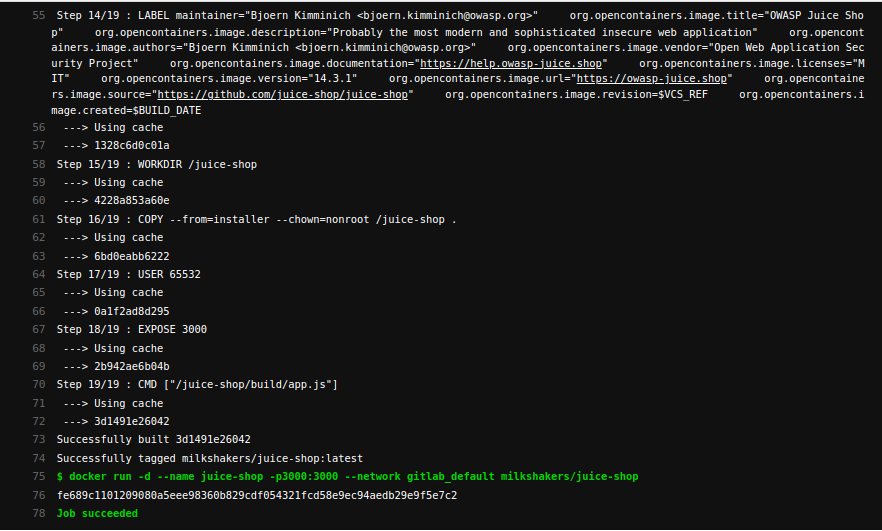
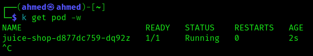
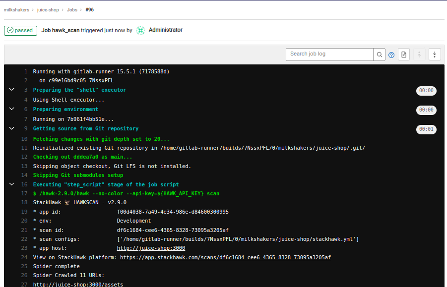
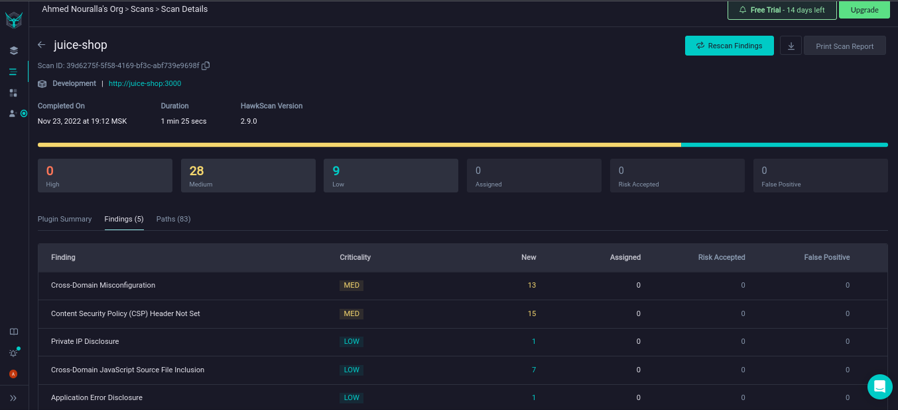

# DevSecOps - Lab 5

## Deploy the vulnerable web app

1. Like previous labs, deploy local GitLab server and runner with `docker-compose`.

   ```bash
   cd gitlab
   docker-compose up
   ```

2. Exec into runner (as root) and run the following

   ```bash
   cd /tmp
   
   # Install docker-cli
   curl -sfL -o docker.tgz "https://download.docker.com/linux/static/stable/x86_64/docker-20.10.9.tgz"
   tar -xzf docker.tgz --strip=1 -C /usr/local/bin
   chmod 666 /var/run/docker.sock
   
   # Install kubectl
   curl -sS -LO "https://dl.k8s.io/release/$(curl -L -s https://dl.k8s.io/release/stable.txt)/bin/linux/amd64/kubectl"
   install -o root -g root -m 0755 kubectl /usr/local/bin/kubectl
   
   # Install Helm 3
   curl -sS https://raw.githubusercontent.com/helm/helm/master/scripts/get-helm-3 | bash
   
   # Install Hawk CLI
   apt update && apt install unzip
   curl -v https://download.stackhawk.com/hawk/cli/hawk-2.9.0.zip -o hawk-2.9.0.zip
   unzip hawk-2.9.0.zip
   cp 
   apt-get install openjdk-17-jdk -y
   
   # Register gitlab runner
   gitlab-runner register # url: http://gitlab, token: obtained from UI, type: shell 
   ```

3. Copy `~/.kube` from host to `gitlab-runner`. This will allow `helm` inside CI to connect to your k8s cluster.

   ```bash
   docker cp ~/.kube $RUNNER_IMAGE_ID:/home/gitlab-runner/.kube
   ```

4. Create a GitLab repo named `juice-shop` and import [juice-shop](https://github.com/juice-shop/juice-shop) into it.

   ```bash
   mkdir project
   cd project
   git clone https://github.com/juice-shop/juice-shop
   cd juice-shop
   sudo rm -rf .git
   cd ..
   git init --initial-branch main
   git remote add origin http://localhost/milkshakers/juice-shop.git
   git add -A
   git commit -m "Initial commit"
   git push --set-upstream origin main
   ```

5. Create [`project/chart`](./project/chart) with a helm chart that contains a [`deployment.yaml`](./project/chart/templates/deployment.yaml) for the application.

   ```yaml
   apiVersion: apps/v1
   kind: Deployment
   metadata:
     name: juice-shop
   spec:
     selector:
       matchLabels:
         app: juice-shop
     template:
       metadata:
         labels:
           app: juice-shop
       spec:
         containers:
           - name: juice-shop
             # local image, run `minikube image load <IMAGE>` before deployment
             image: milkshakers/juice-shop
             imagePullPolicy: Never 
             resources:
               limits:
                 memory: "128Mi"
                 cpu: "500m"
             ports:
               - containerPort: 3000
   
   ```

6. Create [`project/.gitlab-ci.yml`](./project/.gitlab-ci.yml) that builds the app, run it in the same network (needed later for reachability by DAST) and deploys the app to k8s cluster.

   ```yaml
   stages:
     - build_and_run
     - deploy_to_k8s
   
   build_and_run:
     stage: build_and_run
     script:
       - docker build -t milkshakers/juice-shop juice-shop
       - docker run -d --name juice-shop -p3000:3000 --network gitlab_default milkshakers/juice-shop
   
   deploy_to_k8s:
     stage: deploy_to_k8s
     script:
       - helm upgrade --install juice-shop chart --cleanup-on-fail --wait
   ```

7. Push code and check pipeline results.

   

8. Verify app is running in k8s (`k` is an alias for `kubectl`)

   

## Dynamic Analysis with StackHawk

1. Create an account on <http://stackhawk.com> and get an API key and an application ID.

2. Store the API key in a GitLab secret variable named `HAWK_API_KEY`.

3. Create [`project/stackhawk.yml`](./project/stackhawk.yml) with the following configuration.

   ```yaml
   app:
     applicationId: f00d4038-7a49-4e34-986e-d84600300995
     env: Development
     host: http://juice-shop:3000
   ```

4. Update [pipeline](./project/.gitlab-ci.yml) to run a scan before deployment. The docker command was modified to run the container only if it's not already running.

   ```yaml
   stages:
     - build_and_run
     - hawk_scan
     - deploy_to_k8s
   
   build_and_run:
     stage: build_and_run
     script:
       - docker build -t milkshakers/juice-shop juice-shop
       - docker start juice-shop || docker run -d --name juice-shop -p3000:3000 --network gitlab_default milkshakers/juice-shop
   
   hawk_scan:
     stage: hawk_scan
     script:
       - /hawk-2.9.0/hawk --no-color --api-key=${HAWK_API_KEY} scan
   
   deploy_to_k8s:
     stage: deploy_to_k8s
     script:
       - helm upgrade --install juice-shop chart --cleanup-on-fail --wait
   ```

5. Commit code to run pipeline. Scan results will be printed to stdout and a link should show up with scan results.

   

6. We can see from the scan results that StackHawk was able to find three types of issues by scraping 11 endpoints [[PDF Report]](./reports/hawk_unauthenticated_report.pdf).

   

7. By intercepting login traffic to `juice-shop` using burp proxy, we can see that login is performed using a POST request to the endpoint `/rest/user/login` with a JSON body containing `email` and `password`. A successful response body contains an authentication token. A logged-in client needs to supply the token in all subsequent requests using `Set-Cookie` header.

   

8. An authenticated scan allows the DAST tool (i.e., StackHawk) to log in to the web app (e.g., by automatically POSTing form data as above). This should allow the spider to scrape more endpoints and  hence find more vulnerabilities.

9. Add authentication section to [`project/stackhawk.yml`](./project/stackhawk.yml) to allow StackHawk perform authenticated scan on the app.

   ```yaml
   app:
     applicationId: f00d4038-7a49-4e34-986e-d84600300995
     env: Development
     host: http://juice-shop:3000
     authentication:
       loggedInIndicator: "\\QLogout\\E"
       loggedOutIndicator: "\\QLogin\\E"
       usernamePassword:
         type: FORM
         loginPagePath: /rest/user/login
         loginPath: /rest/user/login
         usernameField: email
         passwordField: password
         scanUsername: admin@juice-sh.op
         scanPassword: admin123
       cookieAuthorization:
         cookieNames:
           - token
       tokenExtraction:
         type: TOKEN_PATH
         value: authentication.token
       testPath:
         path: /profile
         success: ".*2[0-9]{2}.*"
         requestMethod: GET
   ```

10. Push code to run pipeline. We can see that authentication was successful and the spider managed to crawl more URLs than the unauthenticated scan.

    

11. Scan results from UI shows more vulnerabilities discovered. More details can be found in the [PDF report](./reports/hawk_authenticated_report.pdf).

    

12. We can limit the scanning **context** by specifying `app.excludePaths` or `app.includePaths`  in [stackhawk.yml](./project/stackhawk.yml). Limiting the context makes the scanning process faster and avoids overwhelming unnecessary/prohibited endpoints with traffic.

## Dynamic Analysis with ZAP

1. Add `zap_scan` job to [`project/.gitlab-ci.yml`](./project/.gitlab-ci.yml). The job will perform 3 scans against `juice-shop` using OWASP ZAP. Reports will show up in the `/tmp` directory in host where GitLab is running.

   ```yaml
   zap_scan:
     stage: zap_scan
     script:
       - |
         docker run --rm --network gitlab_default -v /tmp:/zap/wrk -t \
         owasp/zap2docker-weekly zap-baseline.py -t http://juice-shop:3000 -I -s \
         -r zap_baseline_report.html
       - |
         docker run --rm --network gitlab_default -v /tmp:/zap/wrk -t \
         owasp/zap2docker-weekly zap-full-scan.py -t http://juice-shop:3000 -I -s \
         -r zap_fullscan_report.html -n /zap/wrk/authenticated.context
       - |
         docker run --rm --network gitlab_default -v /tmp:/zap/wrk -t \
         owasp/zap2docker-weekly zap-api-scan.py -t http://juice-shop:3000/b2b/v2 -I -s \
         -f openapi -r zap_api_report.html
   ```

2. **Performed Scans**

   - An unauthenticated baseline scan.

   - An OpenAPI-based scan, given the [spec](https://github.com/juice-shop/juice-shop/blob/master/swagger.yml) for juice-shop.

   - An authenticated full-scan with custom context.

     - The context was exported (target path: `/tmp/authenticated.context`) from ZAProxy GUI after manually logging in to the web application and flagging the POST request as JSON-based authentication [[view context file]](./project/authenticated.context).

     

3. **Reports:**

   - [Unauthenticated Baseline Scan Report](./reports/zap_baseline_report.html) (Alerts: 2 Medium, 1 Low).
   - [Authenticated Full-Scan Report](./reports/zap_fullscan_report.html) (Alerts: 1 High, 175 Medium, 24 Low).
   - [API Scan Report](./reports/zap_api_report.html) (Alerts: 1 High, 4 Medium, 64 Low, 7 Informational).

4. **Remarks**

   - Using unauthenticated scans, the traditional ZAP spider was not able to scrape all endpoints, the vulnerabilities found were not very critical/interesting.
   - Authenticated scans allowed ZAP to scrape more endpoints without getting an unauthorized response. Hence, more critical vulnerabilities were found. The scan took long to finish as it analyzed all `assets` used in the project. This could have been avoided by excluding assets paths from the scan.
   - The API scan was the fastest as it doesn't use a spider. It also allowed ZAP to reach more endpoints that were not otherwise scrape-able.

## Tools Comparison

> Values for vulnerabilities count and scan speed are taken from the results of running authenticated scans in GitLab CI.

|                     | **StackHawk**                                                | **OWASP ZAP**                                                |
| ------------------- | ------------------------------------------------------------ | ------------------------------------------------------------ |
| **Vulnerabilities** | 28 Medium, 9 Low                                             | 1 High, 175 Medium, 24 Low                                   |
| **Integrations**    | Integrates with 20+ developer tools                          | Integrates with 38+ developer tools.                         |
| **Reporting**       | Supports HTML and PDF reports.                               | Supports HTML, MD, XML, JSON reports.                        |
| **Scan speed**      | 1 minute 38 seconds                                          | 13 minutes 15 seconds.                                       |
| **Scan quality**    | Report contains vulnerability name, description, category, severity, and infected endpoint. | Same as StackHawk, with added References, CWE/WASC IDs, and a suggested solution. |
| **Ease of use**     | Nicer UI, easier to integrate with CI, support YAML configuration, more extensive documentation. | Less convenient UI, more complicated to work with and integrate with CI, less extensive documentation. |

### Conclusion

- As a security tester, I would prefer StackHawk over ZAP with relatively-small projects as it's easier to use, has a convenient UI, and integrates quickly with other tools. Being a paid service is a downside though.
- For larger projects that require sophisticated analysis and automation, ZAP would be a better option.
