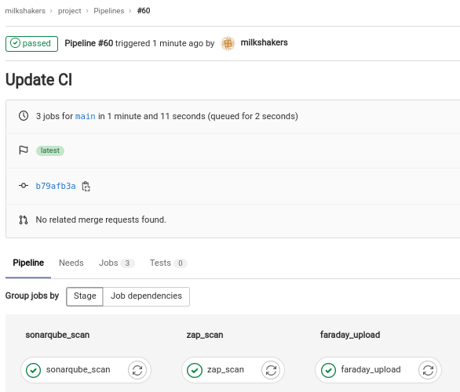

# DevSecOps - Lab 7

## Defect Management

1. Deploy local GitLab server, GitLab runner, [Faraday](https://github.com/infobyte/faraday) server with [Postgres](https://hub.docker.com/_/postgres) and [Redis](https://hub.docker.com/_/redis), [SonarQube](https://hub.docker.com/_/sonarqube) server for SAST, and [juice-shop](https://github.com/juice-shop/juice-shop) app using [docker-compose](./compose/docker-compose.yaml).

   ```bash
   docker-compose up
   ```

2. Exec into runner to register it and install docker-cli like previous labs, use the `shell` executor.

3. Exec into `faraday` container and run `faraday-manage change-password` to change credentials to `faraday:faraday`.

4. Navigate to <http://localhost:5985/> and login using the new credentials. Create a new workspace named `juice-shop`.

5. From GitLab UI at <http://localhost>, create a blank repository `milkshakers/project` and push [juice-shop](https://github.com/juice-shop/juice-shop) to it.

   ```bash
   mkdir project
   cd project
   git clone https://github.com/juice-shop/juice-shop
   cd juice-shop
   sudo rm -rf .git/
   cd ..
   git init --initial-branch main
   git remote add origin http://localhost/milkshakers/project.git
   git add -A
   git commit -m "Initial commit"
   git push --set-upstream origin main
   ```

6. Create [project/.gitlab-ci.yml](./project/.gitlab-ci.yml) that

   - Run SAST with SonarQube (refer to lab 2 to setup SonarQube integration with GitLab).
   - Run DAST with ZAP baseline scan against the live app at <http://localhost:3000>.
   - Upload results to Faraday server. The uploader was not working so I fixed it ([check my PR](https://github.com/infobyte/docker-faraday-report-uploader/pull/1)).

   ```yaml
   stages:
     - sonarqube_scan
     - zap_scan
     - faraday_upload
   
   sonarqube_scan:
     stage: sonarqube_scan
     variables:
       PROJECT_KEY: milkshakers_project_AYTzrjUWS5tza9tlWPZs
     script:
       - |
         docker run --network lab7_default --rm \
         -e SONAR_HOST_URL="http://sonarqube:9000" \
         -e SONAR_SCANNER_OPTS="-Dsonar.projectKey=${PROJECT_KEY} -Dsonar.qualitygate.wait=true" \
         -e SONAR_LOGIN=${SONAR_TOKEN} \
         -v "$(pwd)/:/usr/src" sonarsource/sonar-scanner-cli
       - |
         curl -u "${SONAR_TOKEN}:" \
         http://sonarqube:9000/api/issues/search?componentKeys=${PROJECT_KEY} \
         > /tmp/sonar_report.json
   
   zap_scan:
     stage: zap_scan
     script:
       - |
         docker run --rm -t --network lab7_default -v /tmp:/zap/wrk \
         owasp/zap2docker-weekly zap-baseline.py -t http://app:3000 \
         -I -s -x /tmp/zap_report.xml
   
   faraday_upload:
     stage: faraday_upload
     needs:
       - sonarqube_scan
       - zap_scan
     script:
       - docker build faraday-uploader -t faraday-uploader
       - |
         docker run --rm --network lab7_default -v /tmp:/tmp \
         -e HOST=http://$(docker inspect -f '{{range.NetworkSettings.Networks}}{{.IPAddress}}{{end}}' faraday):5985 \
         -e USERNAME=faraday -e PASSWORD=faraday \
         -e WORKSPACE=juice-shop-$CI_COMMIT_SHORT_SHA \
         -e FILES="/tmp/zap_report.xml /tmp/sonar_report.json" faraday-uploader
   
   ```

7. Push code to run pipeline. Reports are available in [`reports/`](./reports/) directory.

   

8. Check results from Faraday UI at <http://localhost:5985>.

   

   

9. **An example workflow** would be to configure security scans on every push to the main branch. The results would then be uploaded to Faraday. From there, the security specialist may check and confirm findings, group issues by tags, create issues and assign them to developers, monitor vulnerability status (open/closed/reopened/risk accepted), add evidence or custom attributes, generate compliance reports, etc.

10. **How Faraday ...**

    - **Organizes deduplication of findings?** From the vulnerabilities UI, one can group findings by name, tag and other properties. Similar entries may be grouped and examined/deleted in bulk.

    - **Merges similar findings?** Unfortunately, the tool does not support merging similar findings.

    - **Tracks constantly changing code?** It's recommended to configure Faraday uploader to create a workspace per commit, one can easily navigate between workspaces from the drop-down menu in the top-right corner (check the screenshot above).

    - **Distinguishes vulnerabilities in adjacent lines?** Faraday is a vulnerability management UI, its used to visualize reports created from other tools, it has no knowledge of code lines and cannot distinguish them.
