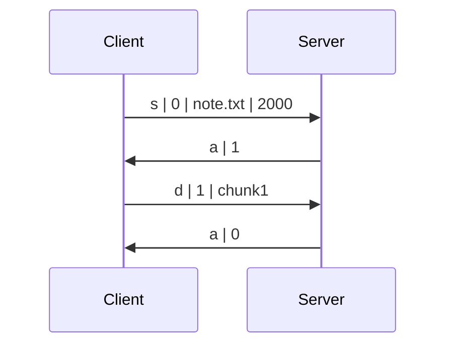

# Week 1 - [Stop-and-Wait ARQ](https://en.wikipedia.org/wiki/Stop-and-wait_ARQ)

> Distributed Systems and Network Programming - Spring 2023

## Task

- Your task for this lab is to write a UDP server using Python [socket](https://docs.python.org/3/library/socket.html) module that communicates with a given client. The client reads a file from the local file system and uploads it to the server.

### Client Implementation

- The client starts by sending the following string message `s|0|filename.ext|filesize` where:
  - `s` indicates that the message type is `start`
  - `|` is the field delimiter.
  - `0` is the initial sequence number.
  - `filename.ext` is the name of the file to be sent (with extension).
  - `filesize` is the total size of the file to be sent <u>in bytes</u>.
- The client expects a reply from the server in the format `a|seqno` where:
  - `a` indicates that the message type is `acknowledgement`.
  - `seqno` equals `(x+1)%2` where `x` is the sequence number of the message to be acknowledged.
- If the expected server acknowledgement was received successfully, the client does the following:
   1. Divide the file into chunks so that the size of a single data packet (including headers) does not exceed the buffer size of the server.
   2. Start sending file chunks, one by one. Each message has the format `d|seqno|data` where:
      - `d` indicates that the message type is `data`
      - `seqno` is the sequence number of the data message, it alternates between `1` and `0`, starting from `1`.
      - `data` is the raw bytes of the file.
   3. The client waits for an acknowledgement message after sending each chunk.
- If an expected acknowledgement message does not arrive within 1 second, the client retransmits the message.
- If an acknowledgement message arrives with an unexpected sequence number, the client ignores that duplicate ACK and keeps waiting for the expected ACK.

### Server Implementation (your task)

1. Parse one integer argument, the port number to listen on.

2. Create a UDP socket and start listening for incoming messages on `0.0.0.0:<port>`.
   - The server should use a fixed receiver buffer size of `20480` bytes (20 Kibibytes).

3. Upon receiving a message from a client, inspect the message type (first character).

   - If the message type is `s`, prepare to receive a file from the client with the given name and size.
   - If the message type is `d`, write the delivered chunk to the file system.
   - Otherwise, terminate gracefully with an error.

4. In both cases, reply with an acknowledge message in the format `a|seqno` where

   - `a` indicates that the message type is `acknowledgement`.
   - `seqno` equals `(x+1)%2` where `x` is the sequence number of the message to be acknowledged.

5. Once the file is received completely, the server should print an indicating message, write the content to the file system, and close the file.

6. If an existing file with the same name is present in the server directory, the server should print an indicating message and overwrite that file with the new one.

7. Your server will be tested under constant delay and packet loss. The following Linux command can be used to simulate 15% packet loss and 1100 milliseconds constant delay over the `lo` interface. File transfer should still succeed after applying the command. To undo the effect use `del` instead of `add`.

   ```bash
   sudo tc qdisc add dev lo root netem loss 15% delay 1100ms
   ```

8. The server stays running unless a fatal error occurs or a `KeyboardInterrupt` is received.

## Testing

- The project structure looks like this

  ```bash
  .
  ├── client
  │   ├── client.py
  │   ├── image.png
  │   └── note.txt
  └── NameSurname.py
  ```
  
- Example run and output

  ```bash
  $ python3 NameSurname.py 8080
  ('0.0.0.0', 8080):    Listening...
  ('127.0.0.1', 48256): s|0|note.txt|446
  ('127.0.0.1', 48256): d|1|chunk1
  ('0.0.0.0', 8080):    Received note.txt.
  ^C('0.0.0.0', 8080):  Shutting down...
  ```
  
  ```bash
  $ cd client
  $ python3 client.py 127.0.0.1:8080 note.txt
  Client: s|0|note.txt|446
  Server: a|1
  Client: d|1|chunk1
  Server: a|0
  ```
  
- Example session visualization



- Resulting directory structure. The text file should arrive intact.

  ```bash
  .
  ├── client
  │   ├── client.py
  │   ├── image.png
  │   └── note.txt
  ├── NameSurname.py
  └── note.txt
  ```

## Checklist

Your submitted code should satisfy the following requirements. Failing to satisfy an item will result in partial grade deduction or an assignment failure (depending on the severity).

- [ ] One submitted source file named according to the format `NameSurname.py`
- [ ] The source code executes successfully under the [latest stable Python interpreter](https://www.python.org/downloads/).
- [ ] The code only imports dependencies from the [standard library](https://docs.python.org/3/library/index.html) (no external dependencies).
- [ ] A sent text/binary file and the corresponding received one are identical (files do not get corrupted in transit).
- [ ] The code works under constant delay and packet loss.
- [ ] The code is readable and nicely formatted (e.g., according to [PEP8](https://peps.python.org/pep-0008/))
- [ ] The source code is the author's original work. Both parties will be penalized for detected plagiarism.

