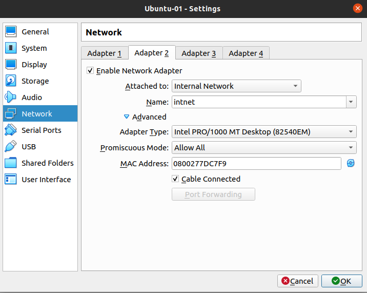
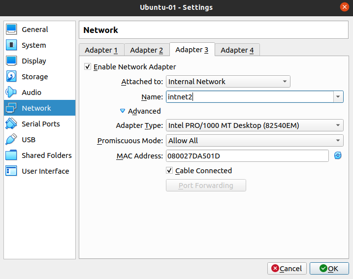

# SNA Lab 6: Linux Networking

## Exercise 1

Configure subinterfaces with VLANs using `netplan` and `ip link`. Below we provided 2 different VLANs to be configured with both mentioned methods accordingly:

- `vlan 10` with IP addresses 192.168.10.10/24 and its gateway 192.168.10.1

  > ## Using `netplan`
  >
  > 1. Edit the main configuration file at `/etc/netplan`.
  >
  >    - In my case config file was called `01-network-manager-all.yaml` and main Ethernet interface was called `eno1` with addresses 10.242.1.196/24
  >
  >    ```yaml
  >    network:
  >        version: 2
  >        renderer: NetworkManager
  >        ethernets:
  >            eno1:
  >                addresses:
  >                    - 10.242.1.196/24
  >                gateway4: 10.242.1.1
  >                nameservers:
  >                    addresses: [8.8.8.8]        
  >        vlans:
  >            vlan.10:
  >                id: 10
  >                link: eno1
  >                addresses:
  >                    - 192.168.10.10/24
  >    ```
  >
  > 2. Then do `netplan try` to test for syntax errors and try for some time if successful.
  >
  >    ```bash
  >    $ sudo netplan try
  >    Do you want to keep these settings?
  >      
  >    Press ENTER before the timeout to accept the new configuration
  >      
  >    Changes will revert in 120 seconds
  >    ```
  >
  > 3. Output from `ip a` 
  >
  >    ```bash
  >    7: vlan.10@eno1: <BROADCAST,MULTICAST,UP,LOWER_UP> mtu 1500 qdisc noqueue state UP group default qlen 1000
  >        link/ether b0:0c:d1:a3:ec:26 brd ff:ff:ff:ff:ff:ff
  >        inet 192.168.10.10/24 brd 192.168.10.255 scope global noprefixroute vlan.10
  >           valid_lft forever preferred_lft forever
  >        inet6 fe80::b20c:d1ff:fea3:ec26/64 scope link 
  >           valid_lft forever preferred_lft forever
  >    ```
  > 
  > 4. Use `netplan apply` if you want to keep changes.
  
- `vlan 20` with IP addresses 192.168.20.20/24 and its gateway 192.168.20.1

  > ## Using `ip link`
  >
  > - Use the following commands:
  >
  >   ```bash
  >   sudo ip link add link eno1 name vlan.20 type vlan id 20
  >   sudo ip addr add 192.168.20.20/24 dev vlan.20
  >   sudo ip link set up dev vlan.20
  >   sudo ip route add default via 192.168.20.1 dev vlan.20
  >   ```
  >
  > - Output from `ip a`
  >
  >   ```bash
  >   vlan.20@eno1: <BROADCAST,MULTICAST,UP,LOWER_UP> mtu 1500 qdisc noqueue state UP group default qlen 1000
  >       link/ether 48:5f:99:0b:c9:b3 brd ff:ff:ff:ff:ff:ff
  >       inet 192.168.20.20/24 scope global vlan.20
  >          valid_lft forever preferred_lft forever
  >       inet6 fe80::4a5f:99ff:fe0b:c9b3/64 scope link 
  >          valid_lft forever preferred_lft forever
  >   ```
  

<div style="page-break-after: always; break-after: page;"></div>

## Exercise 2

Create VM under Ubuntu OS with 3 interfaces :

- First interface with adapter NAT

- Second interface with adapter INTERNAL NETWORK and Name=intnet (enabled promiscious mode)

- Third interface with adapter INTERNAL NETWORK and Name=intnet2 (enabled promiscious mode)

  > 1. Download VirtualBox and Ubuntu 20.04 `.iso` image
  >
  > 2. Create a VM with preferred settings.
  >
  > 3. From VM settings -> Network, set up the following interface settings, note the MAC addresses of both interfaces and that promiscuous mode is enabled.
  >
  >     
  >
  > 
  >
  > 
  >
  > 4. Boot the VM and verify everything is OK using `ip a`
  >
  >    
  >
  > 5. We can bridge `enp0s8` and `enp0s9` together with the following commands:
  >
  >    ```bash
  >    sudo ip link add br0 type bridge
  >    sudo ip link set enp0s8 master br0
  >    sudo ip link set enp0s9 master br0
  >    ```
  >
  > 6. Output from `bridge fdb show` shows that the bridge has both MAC addresses in its table.
  >
  >    
  >
  >    
  

