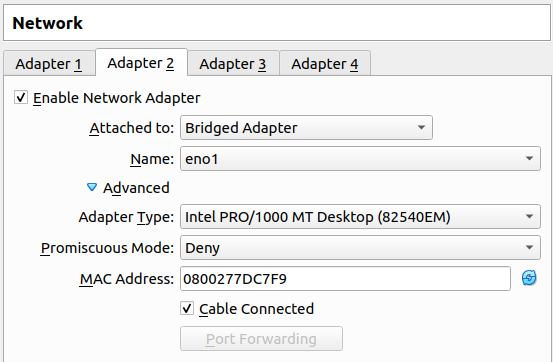
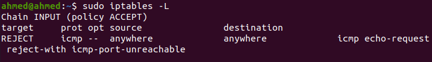
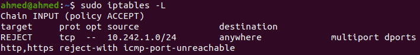
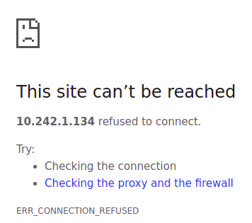
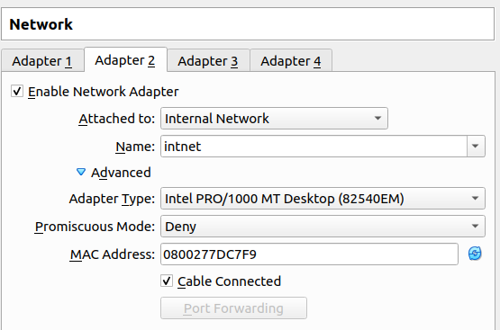

# SNA Lab 7: `iptables` and Firewalls

## Exercise 1

Set your interface on VM as bridged connection and restart interface (interface with network adapter BRIDGED ADAPTER). Install `iptables` with `apt` (if you don't have it). Check existing rules and display them.

> 1. From VM Network settings, we enable the 2nd interface (first one is better left for NAT to enable Internet access on guest). We set the settings as follows:
>
>    
>
> 2. If the machine doesn't have `iptables` we do `apt-get install iptables`
>
> 3. To **L**ist all rules, use `iptables -L` (we can see all chain lists are empty).
>
>    

<div style="page-break-after: always; break-after: page;"></div>

## Exercise 2

Working with INPUT and OUTPUT chains:

- Add a rule1 that blocks ping packets coming into the VM (your server with installed `iptables`).

  > - **Command:**
  >
  >   `iptables -I INPUT -p icmp --icmp-type 8 -j REJECT`
  >
  > - **Explanation:**
  >
  >   - `-I INPUT` is equivalent to `-I INPUT 1` which will insert the rule into the beginning of the INPUT chain.
  >   -  `-p icmp` matches ICMP protocol (the ones used by ping requests).
  >   - `--icmp-type 8` an extension that allows matching a specific type of ICMP requests, in this case, type 8 is the Echo (ping) request.
  >   - `-j REJECT` specifies the action to take when rule matches, which is to reject the packet (same as DROP, but sends a reject response to the sender).
  >
  > - **`iptables -L` output:**
  >
  >   
  >
  > - **Ping reply when trying to ping guest from host**
  >
  >   ```bash
  >   $ ping 10.242.1.134
  >   PING 10.242.1.134 (10.242.1.134) 56(84) bytes of data.
  >   From 10.242.1.134 icmp_seq=1 Destination Port Unreachable
  >   From 10.242.1.134 icmp_seq=2 Destination Port Unreachable
  >   From 10.242.1.134 icmp_seq=3 Destination Port Unreachable
  >   From 10.242.1.134 icmp_seq=4 Destination Port Unreachable
  >   ...
  >   ```


- Delete rule1, then add rule2 that blocks ping packets coming out of the VM - outgoing traffic, you can block specific range of IPs (for example, the range that is being used by your host machine).

  > - **Deleting rule 1:** `iptables -D INPUT 1`
  >
  > - **Adding rule 2:** `iptables -I OUTPUT -p icmp --icmp-type 8 -j DROP`
  >
  >   - Explanation is the same as rule1, except that this time we match outgoing packets using OUTPUT chain, and we DROP matched packets since there is no need to send any rejection message.
  >   - To match only packets destined to host, add `-d 10.242.1.196/24` which in my case was the address used by the host machine.
  >
  > - **`iptables -L` output:**
  >
  >   
  >
  > - **Ping reply when trying to ping host from guest**
  >
  >   ```bash
  >   $ ping 10.242.1.196
  >   PING 10.242.1.196 (10.242.1.196) 56(84) bytes of data.
  >   ping: sendmsg: Operation not permitted
  >   ping: sendmsg: Operation not permitted
  >   ping: sendmsg: Operation not permitted
  >   ping: sendmsg: Operation not permitted
  >   ...
  >   ```

<div style="page-break-after: always; break-after: page;"></div>

## Exercise 3

Install web server on your VM (if you don't have it). Add a rule to the firewall that prevents loading you web server’s IP from the host machine in the browser. Test it by trying to load web page from the VM in your host machine’s web browser (`http://<IP_address_of_your_vm>`).

> 1. Check if apache is installed and running using `systemctl status apache2`
>
> 2. If not, do `apt-get install apache2`
>
> 3. From the output of `ip a` I knew that the VM has an IP address of `10.242.1.134/24` on the bridged adapter interface and the host machine has an IP address of `10.242.1.196/24`
>
> 4. Trying to access the VM from the host machine browser, we get the Apache2 default page:
>
>    
>
> 5. The following `iptables` rule will prevent **the host machine** from accessing the **HTTP/HTTPS webpages** hosted by **the guest webserver**.
>
>    - **Command:** 
>
>      `iptables -A INPUT -s 10.242.1.196/24 -p tcp -m multiport --dports 80,443 -j REJECT`
>
>    - **Explanation:**
>      - `-A INPUT` appends a new rule to the INPUT chain (incoming packets).
>      - `-s 10.242.1.196/24` matches the source IP of the host machine.
>      - `-p tcp` matches TCP packets only (used by HTTP).
>      - `-m multiport` uses the multiport extension that allows matching multiple ports in one rule.
>      - `--dports 80,443` matches ports 80 and 443 used by HTTP and HTTPS, respectively.
>      - `-j REJECT` specifies the action to take when rule matches, which is to reject the packet (same as DROP, but sends a reject response to the sender).
>
> 6. `iptables -L` output:
>
>    
>
> 7. Trying to access the VM from host again as we did in step 4, we get the following error:
>
>    

<div style="page-break-after: always; break-after: page;"></div>

## Exercise 4

Create firewall rules that opens ports for SMTP, DNS, POP3 and SSH connections in your VM and blocking others ports (for you to be able to work with mentioned services).

> - **Rules:**
>
>   ````bash
>   iptables -A INPUT -p tcp -m multiport --dports 25,587 -j ACCEPT # SMTP
>   iptables -A INPUT -p udp --dport 53 -j ACCEPT # DNS
>   iptables -A INPUT -p tcp --dport 110 -j ACCEPT # POP3
>   iptables -A INPUT -p tcp --dport 22 -j ACCEPT # SSH
>   
>   # DROP otherwise (new rules should be inserted before this one)
>   iptables -A INPUT -j DROP
>   
>   # It is assumed that all OUTPUT packets are allowed.
>   ````
>
> - **Enable some services on VM**
>
>   ```bash
>   apt-get install bind9 # DNS server
>   apt-get install openssh-server # SSH server
>   ```
>
> - **Testing rules with `netcat`**
>
>   ```bash
>   $ nc -vz 10.242.1.134 22
>   Connection to 10.242.1.134 22 port [tcp/ssh] succeeded!
>       
>   $ nc -vzu 10.242.1.134 53
>   Connection to 10.242.1.134 53 port [udp/domain] succeeded!
>       
>   $ nc -vzu 10.242.1.134 80 # Testing a port not in rules
>   nc: connect to 10.242.1.134 port 80 (tcp) failed: Connection refused
>   ```

<div style="page-break-after: always; break-after: page;"></div>

## Bonus

Create a scenario on your machine and implement it where you can apply NAT rules and test it

- Firstly, Flush all existing rules in `iptables`.

  > `iptables -F`

- Add second interface for your VM with adapter set to INTERNAL NETWORK and Name=`intnet`. And assign IP address `192.168.100.5/24` to your interface.

  > 1. Edit VM network settings (first adapter is used for NAT to host)
  >
  > 
  >
  > 
  >
  > 2. Run `ip addr add 192.168.100.5/24 dev enp0s8` inside the VM.
  > 3. From the output of `ip a` we know that `enp0s3` corresponds to the first interface (NAT) and `enp0s8` corresponds to the second (`intnet`)

- Then Enable IP forwarding on your VM kernel.

  > 1. Run `nano /etc/sysctl.conf`
  >
  > 2. Uncomment the line `net.ipv4.ip_forward=1`
  > 3. Save the changes and run `sysctl -p /etc/sysctl.conf`
  > 4. You may need to restart the machine for changes to take effect.
  > 5. Verify with `iptables -t nat -L`, you should see the empty table with `POSTROUTING` chain there.

- Configure the firewall for IP masquerading from internet-facing interface.

  > `iptables -t nat -A POSTROUTING -o enp0s3 -j MASQUERADE`

- Add a second VM with INTERNAL NETWORK adapter and Name=`intnet`. Configure static IP address on interface from range 192.168.100.0/24 and set gateway for its interface as 192.168.100.5. Check that you can ping its gateway reachability.

  > 1. Second VM will have only one `intnet` interface enabled, used to connect to `enp0s8` at the first VM.
  >
  >    
  >
  > 2. From the output of `ip a` we see that this interface is called `enp0s3`
  >
  > 3. Configure a static IP for the interface
  >
  >    `ip addr add 192.168.100.1/24 dev enp0s8`
  >
  > 4. To enable Internet access on this VM, let's configure the default gateway to be the first VM using:
  >
  >    `ip route add default via 192.168.100.5`
  >
  > 5. Check that gateway is reachable `ping 192.168.100.5`
  >
  >    ```bash
  >    $ ping 192.168.100.5
  >    PING 192.168.100.5 (192.168.100.5) 56(84) bytes of data.
  >    64 bytes from 192.168.100.5: icmp_seq=1 ttl=64 time=0.495 ms
  >    64 bytes from 192.168.100.5: icmp_seq=2 ttl=64 time=1.32 ms
  >    64 bytes from 192.168.100.5: icmp_seq=3 ttl=64 time=1.24 ms
  >    ...
  >    ```
  >
  > 6. Check Internet connectivity from the second VM.
  >
  >    ```bash
  >    $ ping 8.8.8.8
  >    PING 8.8.8.8 (8.8.8.8) 56(84) bytes of data.
  >    64 bytes from 8.8.8.8: icmp_seq=1 ttl=61 time=35.2 ms
  >    64 bytes from 8.8.8.8: icmp_seq=2 ttl=61 time=34.9 ms
  >    64 bytes from 8.8.8.8: icmp_seq=3 ttl=61 time=35.5 ms
  >    ...
  >    ```
  >
  > 7. Screenshot for verification
  >
  >    

