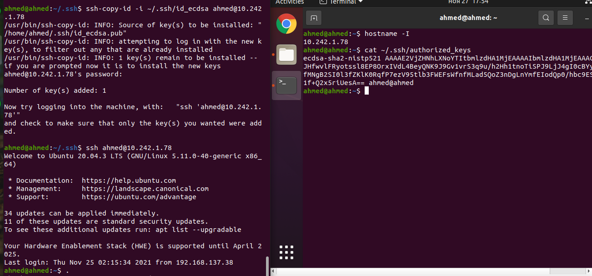

# SNA Lab 8: SSH and SSL

## Exercise 1

Generate SSH key pair using an algorithm other than RSA. Use the key pair to access a remote machine (e.g., VM). Provide all necessary secure configuration.

> 1. Generating ECDSA 521-bit key pair. If everything was left as default:
>
>    - The public key will be saved in `~/.ssh/id_ecdsa.pub`
>    - The private key will be saved in `~/.ssh/id_ecdsa`
>    - There will be no passphrase required for accessing the private key.
>
>    ```bash
>    $ ssh-keygen -t ecdsa -b 521
>    Generating public/private ecdsa key pair.
>    Enter file in which to save the key (/home/ahmed/.ssh/id_ecdsa): 
>    Enter passphrase (empty for no passphrase): 
>    Enter same passphrase again: 
>    Your identification has been saved in /home/ahmed/.ssh/id_ecdsa
>    Your public key has been saved in /home/ahmed/.ssh/id_ecdsa.pub
>    The key fingerprint is:
>    SHA256:BDBMMSjskLEOjbDKHwESeCcpbwCyuLoWFyjlGBbc6sg ahmed@ahmed
>    The key's randomart image is:
>    +---[ECDSA 521]---+
>    |%*o=*o.          |
>    |&XB.oo .         |
>    |@@++    .        |
>    |B=+..  .         |
>    |B+ ..   S        |
>    |oE...            |
>    |. o.             |
>    | o               |
>    |o                |
>    +----[SHA256]-----+
>    ```
>
> 2. Create a VM with the following:
>
>    - A single bridged network adapter attached to the host's Ethernet interface, note down the output of `hostname -I` for guest.
>      - In my case it was `10.242.1.78`
>    - A user with `sudo` privileges, note down username and password for that user.
>      - I created a user `ahmed` with a dumb password.
>
>    - OpenSSH installed: `sudo apt install openssh`
>
> 3. Copy the key from host to guest
>
>    - Run in host machine: `ssh-copy-id ahmed@10.242.1.78`, enter password.
>
>      - If prompted that the authenticity cannot be established, enter `yes` to add the VM to the list of known hosts.
>
>      ```bash
>      $ ssh-copy-id -i ~/.ssh/id_ecdsa ahmed@10.242.1.78
>      /usr/bin/ssh-copy-id: INFO: Source of key(s) to be installed: "/home/ahmed/.ssh/id_ecdsa.pub"
>      /usr/bin/ssh-copy-id: INFO: attempting to log in with the new key(s), to filter out any that are already installed
>      /usr/bin/ssh-copy-id: INFO: 1 key(s) remain to be installed -- if you are prompted now it is to install the new keys
>      ahmed@10.242.1.78's password: 
>                
>      Number of key(s) added: 1
>                
>      Now try logging into the machine, with:   "ssh 'ahmed@10.242.1.78'"
>      and check to make sure that only the key(s) you wanted were added.
>      ```
>
> 4. Key should now be added to the file `~/.ssh/authorized_keys`
>
> 5. Access the virtual machine and verify everything is working.
>
>    ```bash
>    $ ssh ahmed@10.242.1.78
>    Welcome to Ubuntu 20.04.3 LTS (GNU/Linux 5.11.0-40-generic x86_64)
>    
>     * Documentation:  https://help.ubuntu.com
>     * Management:     https://landscape.canonical.com
>     * Support:        https://ubuntu.com/advantage
>    
>    34 updates can be applied immediately.
>    11 of these updates are standard security updates.
>    To see these additional updates run: apt list --upgradable
>    
>    Your Hardware Enablement Stack (HWE) is supported until April 2025.
>    Last login: Thu Nov 25 02:15:34 2021 from 192.168.137.38
>    ```
>
> 6. You can later disable password authentication to the VM for security against brute-force attacks.
>
>    ```bash
>    $ sudo nano /etc/ssh/sshd_config
>    # Add or uncomment the line `PasswordAuthentication no`
>    
>    $sudo systemctl restart ssh
>    # Make sure you can still login to the machine before closing terminal.
>    ```
>
> 7. Screenshot for verification
>
>    

## Exercise 2

Create root CA and generate your domain certificate with public and private keys. Generate a Certificate Signing Request for your domain certificate then generate your certificate with use the CA’s signature to form a certificate using CA certificate, set expiration days to 365. Show your content of certificate with attributes: Issuer, Validity, Serial Number, Subject etc. Convert your certificate to DER format.

> 1. Install `openssl` with `sudo apt install openssl`
>
> 2. Create a private RSA 4096-bit key called `rootCA.key`, will be used by our CA to sign certificates.
>
>    ```bash
>    $ openssl genrsa -out rootCA.key 4096
>    Generating RSA private key, 4096 bit long modulus (2 primes)
>    .......................................++++
>    ................................................................++++
>    e is 65537 (0x010001)
>    ```
> 
> 3. Create a self-signed root certificate called `rootCA.crt`
>
>    - **Command**
>
>      ```bash
>      $ openssl req -x509 -new -nodes -key rootCA.key -sha256 -days 365 -subj "/C=RU/ST=Tatarstan/O=IU/CN=RootCA" -out rootCA.crt
>      ```
>
>    -  **Explanation**
>       - `req -x509 -new` request a new self-signed certificate
>       - `-nodes` no DES encryption is used.
>       - `-key rootCA.key` supplying the private key we created in the previous step, to be used to sign the certificate.
>       - `-sha256` the message digest algorithm to be used is SHA256.
>       - `-days 365` the certificate is valid for a year.
>       - `-out rootCA.crt` output file location.
>       - `-subj "/C=RU/ST=Tatarstan/O=IU/CN=RootCA"` specifies the certificate information (country, state, organization, common name) to fill non-interactively.
> 
> 4. Create another private key for my domain (e.g.,`ahmednouralla.com`)
> 
>    ```bash
>    $ openssl genrsa -out domain.key 4096
>    Generating RSA private key, 4096 bit long modulus (2 primes)
>    .......................................++++
>    ................................................................++++
>    e is 65537 (0x010001)
>    ```
> 
> 5. Create `san.conf` with the following content:
> 
>    ```bash
>    [req]
>    default_bits       = 4096
>    distinguished_name = req_distinguished_name
>    req_extensions     = req_ext
>   
>    [req_distinguished_name]
>    countryName             = Country Name (2 letter code)
>    stateOrProvinceName	   = State or Province Name (full name)
>    localityName            = Locality Name (eg, city)
>    organizationName        = Organization Name (eg, company)
>    commonName              = Common Name (e.g. server FQDN or YOUR name)
>    
>    [req_ext]
>    subjectAltName = @alt_names
>    
>    [altnames]
>    DNS.1 = ahmednouralla.com
>    DNS.2 = www.ahmednouralla.com
>    ```
>    
>    - **Explanation:**
>      - This configuration file will be used to generate the Certificate Signing Request (CSR) we will use later to generate the certificate for my domain.
>      - Its main purpose is to specify the Subject Alternative Names (SANs) extension parameters, this allows the certificate to work for multiple domain names specified by DNS.1, DNS.2 and so on.
>      - Many web browsers stopped recognizing certificates without this extension, the old method was to match requested address with CommonName, which allowed only one entry (that can be a wildcard).
> 
> 6. Create a Certificate Signing Request (CSR) that will be used to verify my domain using our self-signed `rootCA.crt`
> 
>   ```bash
>    $ openssl req -new -sha256 -key domain.key -subj "/C=RU/ST=Tatarstan/O=IU/CN=ahmednouralla.com" -reqexts req_ext -config san.conf -out domain.csr
>    ```
> 
>    - **Explanation**
>
>       - `req -new -sha256 -key domain.key` requests a new certificate with SHA256 as the message digest for signing the request, and `domain.key` as the private key.
>     - `-subj "/C=RU/ST=Tatarstan/O=IU/CN=ahmednouralla.com"`  specifies the request information (country, state, organization, common name) to fill non-interactively.
>      - `-config san.conf` uses the configuration file we created in the previous step.
>     - `-reqexts req_ext` specifies the field in `san.conf` that contain the request extensions.
>      - `-out domain.csr` output the request file to `domain.csr`
> 
> 7. Generate the certificate signed by `rootCA.crt` in reply to the CSR in `domain.csr`
>
>    ```bash
>    $ openssl x509 -req -in domain.csr -CA rootCA.crt -CAkey rootCA.key -CAcreateserial -out domain.crt -days 365 -sha256 -extfile san.conf -extensions req_ext
>    Signature ok
>    subject=C = RU, ST = Tatarstan, O = IU, CN = ahmednouralla.com
>    Getting CA Private Key
>    ```
> 
>   - **Explanation**
>     - `-extfile san.conf -extensions req_ext` specifies the extensions used and the configuration file used.
>     - `-CAcreateserial` creates a CA serial number if didn't exist.
> 
>8. Screenshot for verification
> 
>    
> 
> 9. To be able to use this certificate we need to import `rootCA.crt` into the list of trusted root CAs in the client OS or browser, the exact steps to follow depends on the browser or OS but is generally simple to do.
> 
> 10. Command to convert PEM (`domain.crt`) to DER (`domain.der`) for usage with Java.
>
>     ```bash
>     $ openssl x509 -in domain.crt -outform der -out domain.der
>     ```
>
>        
>
