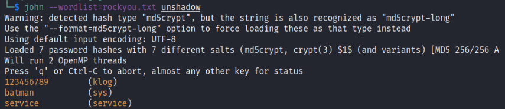

# Lab 4: OS-Security

## Metasploitable2

- Download and setup Metasploitable2
- Attached it to `eno1` interface on which the host and attacker are connected.
  - Host address: 10.0.0.2
  - Guest (Metasploitable) address: 10.0.0.4
  - Attacker address: 10.0.0.3
- Added a static address in the same subnet using `sudo ip a add 10.242.1.246/24 dev eth0`
- Gave that address to the attacker to set as RHOST.

- Attacker ran `msfconsole` and used `exploit/multi/samba/usermap_script` with `payload/cmd/unix/reverse` to gain a reverse shell in metasploitable.
- Attacker copied the contents of `/etc/shadow` and `/etc/passwd` to his machine and used john the ripper with `rockyou.txt` password list to crack the passwords.

