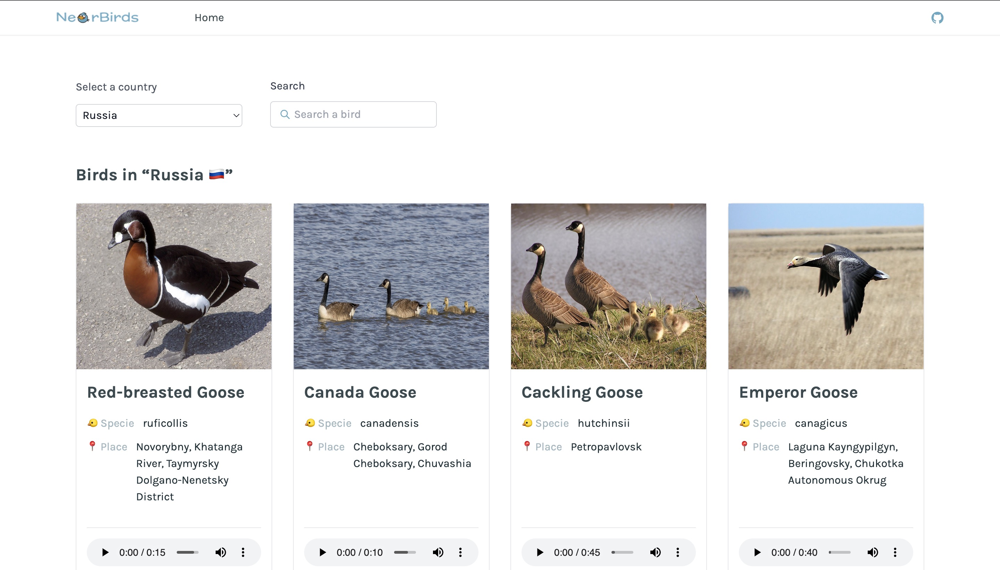
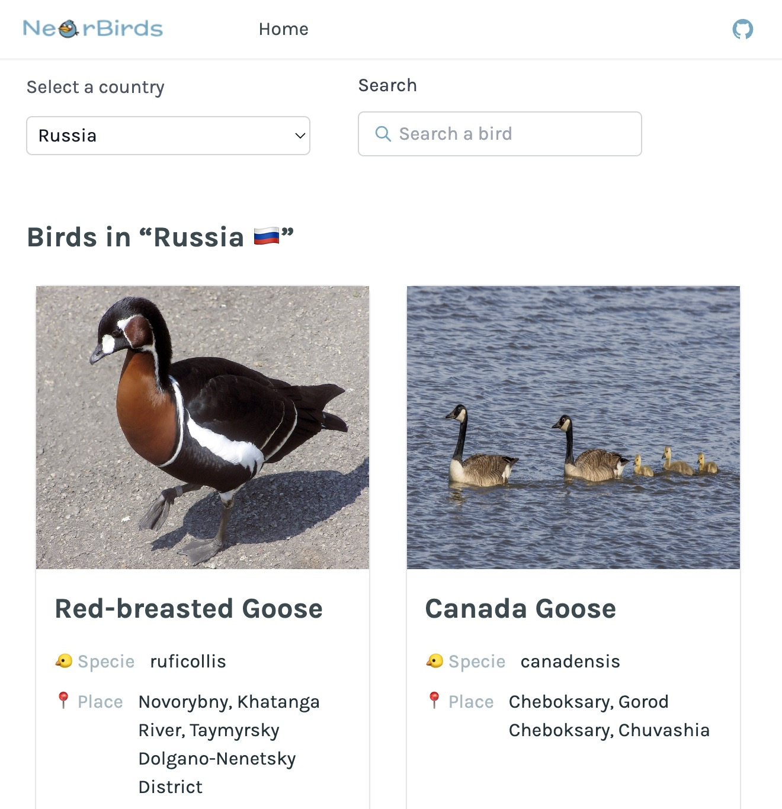
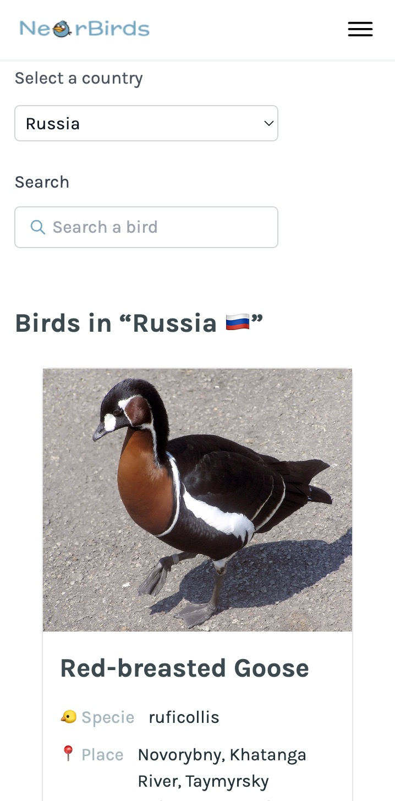

 

# NearBirds

Discover birds in your region and listen to their chirping.

<details>
  <summary><strong>Screenshots</strong></summary>
  <table>
    <tbody>
      <tr>
        <td></td>
        <td></td>
        <td></td>
      </tr>
    </tbody>
  </table>
</details>

## Features

- 🐥 Birds list
- 🏳️ List of countries
- ⏳ Page loader
- 🔀 Website navigation bar
- 🎧 Birds song
- 📱 Mobile version of website
- 🔎 Birds list page search

 More details about website features [here](https://docs.google.com/document/d/1Z5fMy3GKXVEUm8NAlcUJOqv7prlsKXJHYE4XdYm2gzk/edit?usp=sharing).

## Quality Assurance

These tools were used to ensure software quality and reliability of the web application

- [ESLint](https://eslint.org/) enforces code style and helps to catch bugs early in development
- [Husky](https://typicode.github.io/husky/#/) installs Git hooks to run static checkers before each commit
- [Jest](https://jestjs.io/) to run unit tests
- [Selenium](https://www.selenium.dev/) to run UI tests
- [GitHub Actions](https://github.com/features/actions) to run CI pipelines on source code updates
- [UptimeRobot](https://uptimerobot.com/) to monitor application availability
- [Watchtower](https://containrrr.dev/watchtower/) for auto-deployment of the latest docker container image
- [DigitalOcean Metrics Agent](https://docs.digitalocean.com/products/monitoring/quickstart/) to monitor resource usage and network load for the application
- [npm-audit](https://docs.npmjs.com/cli/v9/commands/npm-audit) to check project for vulnerabilities
- [Sentry](https://sentry.io/) to track frontend-related errors
- [LightHouse](https://github.com/GoogleChrome/lighthouse-ci) to test application performance

## Run in Docker

```bash
docker build -t nearbirds .
docker run -p 3000:3000 nearbirds
```

## Run for local development

```bash
npm install
npm run start
```

It runs the app in the development mode. Open [http://localhost:3000](http://localhost:3000) to view it in the browser.

## License

The source code of this project is distributed under the terms of the MIT license.

All rights to the pictures belong to the owners.
